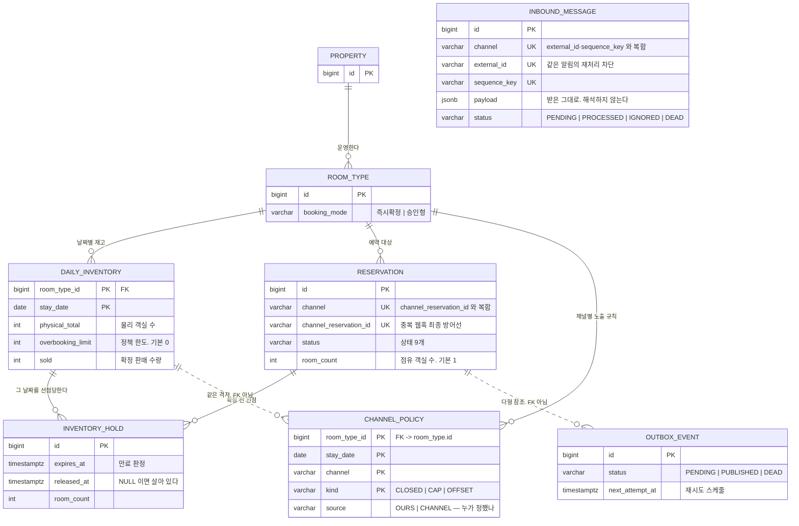
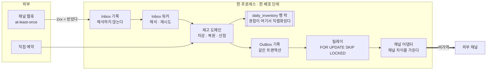

# stay-inventory-sync

여러 채널에서 동시에 팔리는 숙박 재고의 **정합성**을 구조적으로 지켜 보려고 만든
최소한의 백엔드 실험입니다.

기능을 넓게 만드는 대신, **한 가지 문제를 끝까지 증명하는 것**을 목표로 삼았습니다.

> **숙박 PMS 전체를 만들지는 않았습니다.** 여러 채널로 예약을 받을 때 가장 비싼 값을
> 치르게 되는 사고가 재고 불일치인데, 그것을 **막고 · 발견하고 · 되돌리는 최소한의 코어**만
> 구현했습니다. 무엇을 범위에서 잘라냈고 왜 잘랐는지는 [3. 범위](#3-범위)에 적어 두었습니다.
>
> 직접 반증해 보다가 찾아낸 정합성 결함이 세 건(`#64` · `#71` · `#72`) 있었는데,
> 어쩌다 생겼는지까지 남긴 뒤에 닫았습니다. **아직 채우지 못한 공백 여덟 개**는
> [`08-failure-and-recovery.md`](docs/08-failure-and-recovery.md) §9 에 착수 조건과 함께
> 적어 두었습니다. 완성된 PMS 라고 말씀드리지는 않겠습니다.

## 무엇에 중점을 두었나

여기 적는 것은 기능 목록이 아니라 **무엇을 기준으로 판단했는가**입니다.

**1. "했다" 대신 "지우면 깨진다"로 말합니다.**
"동시성 처리를 했습니다"라는 말만으로는 아무것도 증명되지 않습니다. 그래서 이 저장소는
방어 하나하나에 **그것을 지웠을 때 실패하는 테스트**를 짝지어 두었고, 실제로 지워 보고
확인했습니다 (→ [무엇이 증명됐는가](#무엇이-증명됐는가--그리고-무엇을-깨뜨려-확인했는가)).

**2. 규칙을 지키게 만들기보다, 어길 수 있는 자리를 없앱니다.**
*"락 순서를 지키자"* 같은 약속은 결국 사람이 리뷰로 지켜야 합니다. 대신 조건부 UPDATE 의
`rowcount` 를 확인해야만 다음 단계로 넘어갈 수 있게 만들어 두면, **순서를 어기려면 코드
구조 자체를 뒤집어야** 합니다. 날짜 목록도 만들어 놓고 정렬하는 대신 **처음부터 오름차순으로
생성**하면, 실수로 지울 정렬 코드가 아예 없습니다. 이렇게 막을 수 없는 경로는 ArchUnit 이
컴파일과 CI 에서 끊어 줍니다.

**3. 판단은 문서에 남깁니다.**
ADR 12개에 채택한 안과 **기각한 대안**을 함께 적었습니다. 구현하다가 문서가 틀렸다는 것을
알게 되면, 문서를 조용히 고치지 않고 **먼저 이슈로 올려 판단을 남긴 뒤에** 고칩니다
(`#48` 이 그런 경우였습니다).

---

## 1. 문제 정의

숙박 사업자는 자사 채널과 여러 OTA(에어비앤비, 야놀자 등)에서 같은 재고를 함께 팝니다.
이 구조에서는 두 종류의 불일치가 반드시 생깁니다.

### (a) Dual-write

예약을 내부 DB 에 저장하는 일과, 그 결과를 외부 채널 API 에 반영하는 일은 서로 다른
트랜잭션입니다. 둘 중 한쪽만 성공하면 이미 팔린 객실이 다른 채널에서 또 팔립니다.

### (b) 중복 수신

채널은 예약 웹훅을 at-least-once 로 보냅니다. 즉 **한 번 이상은 반드시 보내지만, 딱 한 번만
보낸다는 보장은 없습니다.** Channex(채널매니저) 기준으로는 5XX 응답을 받으면 최대 10회까지
재시도하고, 마지막 시도는 원래 이벤트로부터 약 24시간 뒤에 옵니다.
막아 두지 않으면 예약 1건이 N건이 되고 재고가 그만큼 더 깎입니다.

### 비용

두 경우 모두 결과는 **오버부킹**입니다.
그리고 그 값은 시스템이 아니라 현장이 치릅니다. 환불, 룸 이동, CS 응대, 그리고 그 모든 것을
조율하는 사람의 시간입니다.

### 어떤 오버부킹을 막는가

오버부킹에는 두 종류가 있는데, **이 프로젝트가 다루는 것은 아래쪽 하나입니다.**

| | 성격 | 이 프로젝트 |
|---|---|---|
| **의도적** 오버부킹 | 수익관리 전략입니다. 노쇼가 하루 5~15% 나 되고, 안 팔린 객실은 그날로 사라집니다 | **막지 않습니다.** 정책 한도로 표현합니다 |
| **사고성** 오버부킹 | 동기화 오류 · 중복 수신 · 수기 실수 | **0 으로 만듭니다** |

그래서 `total` 을 `물리 객실 수 + 정책 한도` 로 정의했습니다 (`A8`, ADR-0007).
시스템은 정책이 허용한 선을 한 칸도 넘지 않습니다. **넘을 수 있는 것은 의도치 않은 초과뿐입니다.**

초과 판매를 아예 못 하게 막아 버리는 시스템은 현장에서 거부당합니다.
그리고 거부당하면 현장이 시스템 밖으로 우회로를 만들기 때문에,
**"재고의 원본은 우리"라는 전제 자체가 깨집니다.**

### 왜 "확인 업무"부터 보았나

운영 자동화의 대상은 보통 수기 업무 · 확인 업무 · 병목, 이렇게 묶어서 이야기합니다.
이 중에서 **가장 많은 것을 알려 주는 쪽은 확인 업무**라고 보았습니다.

수기 업무는 아직 도구가 없어서 생깁니다. 만들어 주면 해결됩니다.
그런데 확인 업무는 다릅니다. **시스템이 이미 있는데도 그 결과를 믿지 못하고 있다는 뜻**이니까요.
채널 재고를 사람이 매일 눈으로 맞춰 보고 있다면, 그 조직은 동기화가 틀릴 수 있다는 것을
이미 알고 있는 셈입니다.

이때 대조 작업을 자동화하면 증상만 빨리 발견될 뿐입니다.
**확인이 필요 없어지려면 애초에 틀리지 않아야 합니다.**

그래서 이 프로젝트는 감지가 아니라 **원인**부터 다뤘습니다.
정합성이 보장된 뒤에 남는 불일치 리포트는 예외를 잡아내는 장치가 되지,
매일 해야 하는 일로 남지 않습니다.

**이 프로젝트가 다루는 것은 위 두 지점뿐입니다.**

### 무엇이 증명됐는가 — 그리고 무엇을 깨뜨려 확인했는가

이 저장소가 하는 주장은 *"동시성 처리를 했습니다"* 가 아니라
**"이 방어를 지우면 이 테스트가 실패합니다"** 입니다. 방어마다 실제로 지워 보고 확인했습니다.

| 지운 것 | 실패한 것 |
|---|---|
| 재고 행 락 (`FOR UPDATE` → `findById`) | `T1` 계열 3종 · `T2` |
| 조건부 UPDATE 의 `AND status = 'CONFIRMED'` | `T5` · `T5 확장` |
| 어댑터의 멱등키 흡수 | `T4` |
| 집기-임대 (`SKIP LOCKED`) | `B3` |
| 버전 스탬프 판정 | `B4` 계열 4종 |
| 레이트 리밋의 재시도 예산 면제 | DLQ 2종 |
| 순서 키의 `aggregate_type` | 레인 분리 |
| 조기 반환의 `IS NOT DISTINCT FROM` | 순서키 `null` 판정 |
| 엔티티 연관 매핑 금지 | ArchUnit |
| 불변식 훅 등록 (양쪽 엔진 각각) | 도달 테스트 2종 |

**그런데 이렇게 지웠는데도 테스트가 그냥 통과해 버린 적이 네 번 있었고, 네 번 다 잘못은
방어가 아니라 테스트 쪽에 있었습니다.** 그때 무엇이 잘못돼 있었는지는
[`03-testing-strategy.md`](docs/03-testing-strategy.md)
「반증이 통과하면 반증 절차를 먼저 의심한다」에 표로 정리해 두었습니다.

---

## 2. 가정

실제 운영 시스템의 내부 구조는 알 수 없으니, 아래와 같이 전제하고 시작했습니다.

| # | 가정 | 근거 / 영향 |
|---|---|---|
| A1 | 객실은 개별 호실이 아니라 **룸타입 단위**로 팔립니다 | 업계 표준입니다. 호실 배정은 체크인 시점의 관심사로 떼어 냈습니다 |
| A2 | 재고는 **날짜별 잔여 수량**으로 관리됩니다 | 여러 날짜에 걸친 예약이 여러 행에 걸치게 됩니다 |
| A3 | 모든 채널이 **하나의 공유 재고**를 바라봅니다 (pooled) | ADR-0001 참고 |
| A4 | 채널 API 는 **at-least-once** 로 웹훅을 보냅니다 | Channex 공개 스펙 |
| A5 | 재고는 **선점(hold) 시점에 잡히고 확정 시점에 차감됩니다** | 선점은 `daily_inventory` 가 아니라 별도 테이블에서 셉니다. ADR-0010 |
| A6 | 요금(rate)은 재고와 독립적인 축입니다 | 범위에서 제외했습니다 |
| A7 | 예약 1건이 **여러 객실을 점유할 수 있습니다** (`room_count`, 기본 1) | 다객실 예약을 범위 밖으로 두면 `UNIQUE(channel, channel_reservation_id)` 와 충돌합니다. `docs/01-domain-model.md` 참고 |
| A8 | `total` 은 **물리 객실 수 + 정책 오버부킹 한도**입니다 (한도 기본 0) | 의도적 오버부킹과 사고성 오버부킹을 구분하기 위해서입니다. ADR-0007 |

---

## 3. 범위

### 만든 것

| 층 | 무엇 | 증명 |
|---|---|---|
| 도메인 | 8개 테이블 (+ 운영 1개) · 상태 전이표 · 불변식 4종 | `INV-1`~`INV-4` 를 **모든 테스트 종료 시** 검사합니다 |
| 재고 | 다일 원자적 차감 · 취소 복원 | **`T1` `T2` `T5` `T6`** |
| 인바운드 | 웹훅 Inbox 수신 · 멱등 흡수 | **`T3`** |
| 아웃바운드 | Outbox 릴레이 · 채널 어댑터 · 백오프 | **`T4`** |
| 순서 | 키 단위 버전 스탬프 · 배치 병합 | `B4` |
| 다중 인스턴스 | 집기-임대 (`FOR UPDATE SKIP LOCKED`) | `B3` |
| 운영 | 재고 diff 리포트 · Outbox DLQ · 지표 3덩어리 | `B1` `B2` `B5` |
| 정책 | 채널별 노출 상한 (캡형 hybrid) | **`T11` `T12`** |
| 수렴 | 정기 재동기화 (키셋 커서 · 단일 실행 · 수동 트리거) | `B6` |

**테스트 264개** 중 **241개가 Testcontainers 위에서 도는 진짜 PostgreSQL** 을 씁니다.
H2 를 쓰지 않은 이유는 `SELECT FOR UPDATE` 의 동작이 달라서
**락을 검증한다는 말 자체가 성립하지 않기 때문**입니다.

나머지 23개는 DB 가 필요 없습니다. 상태 전이표 12개와 ArchUnit 11개입니다.
**이 둘을 DB 없이 검사할 수 있다는 점이 `domain` 과 `persistence` 를 가른 이유**이고,
덕분에 상태 규칙이 맞는지 보려고 컨테이너를 띄울 일이 없습니다.

### 만들지 않은 것

| 제외 | 이유 |
|---|---|
| 게스트·사장님용 프론트엔드 | 백엔드 문제이고, 검증 대상은 API 계약과 정합성입니다 |
| 그 밖의 화면 | **운영 콘솔 한 장은 만들었습니다** (`#80`). §7 의 제목이 *"무엇을 보고 무엇을 누르나"* 인데 그 답이 `curl` 이면 주장과 산출물이 어긋납니다. 빌드 단계도 프레임워크도 없는 HTML 한 파일이고, **여기서 멈추는 것까지가 범위 판단입니다** |
| 인증/권한 | 문제 정의와 직교합니다. 붙을 위치만 명시했습니다 |
| 요금 정책 엔진 | 재고 정합성과는 독립적인 별개의 문제 축입니다 (A6) |
| 실제 OTA 연동 | 계약과 인증이 필요합니다. 공개 스펙을 모방한 스텁으로 대체했습니다 |
| 배포 / IaC | 3일 안에 검증할 수 없습니다. 로컬 재현성만 보장합니다 |
| Kafka | ADR-0004 에 도입 조건과 마이그레이션 경로를 적었습니다 |

범위 판단의 전체 근거는 `docs/02-scope.md` 에 있습니다.

---
## 4. 데이터 모델

테이블은 **8개**입니다. 여기서는 관계와 키만 먼저 보시면 되고, 컬럼까지 다 있는 ERD 는
[`docs/01-domain-model.md`](docs/01-domain-model.md) 에 있습니다.



**실선(`--`)은 DB 의 FK 로 강제되는 관계이고, 점선(`..`)은 키를 공유하거나 논리적으로만
이어져 있는 관계입니다.** `channel_policy` 를 `daily_inventory` 에 FK 로 묶어 버리면
**재고 행이 아직 만들어지지 않은 미래 날짜에는 노출 상한을 미리 걸어 둘 수 없게 됩니다.**
캡을 걸어 운영할 때 실제로 필요한 동작이라서 묶지 않았습니다.

### 이 그림에서 봐야 할 다섯 가지

**① `total` 컬럼이 없습니다.** `physical_total` 과 `overbooking_limit` 두 개로 나눠 두었고,
합계는 그때그때 계산합니다. 하나로 합쳐 버리면 지표 · 경고 · 되돌림 세 가지를 한꺼번에
잃습니다 ([ADR-0007](docs/adr/0007-overbooking-policy.md)).

**② `sold` 는 속도를 위한 최적화가 아니라, 경합을 한 줄로 세우는 자리입니다.**
예약 테이블을 매번 집계해서 잔여를 구하면 "남은 1개를 100명이 동시에 요청" 하는 상황을
막을 자리가 없습니다. 카운터가 들어 있는 행을 잠가야 비로소 순서대로 처리됩니다.

**③ `UNIQUE` 제약 세 개가 멱등성을 DB 에 맡깁니다.** 애플리케이션 코드가 아니라 제약이
판정합니다.

```text
reservation      UNIQUE(channel, channel_reservation_id)          중복 웹훅
inbound_message  UNIQUE NULLS NOT DISTINCT                        같은 알림 재처리
                   (channel, external_id, sequence_key)
channel_policy   PK(room_type_id, stay_date, channel, kind)       규칙 중복
```

여기서 `inbound_message` 의 `NULLS NOT DISTINCT` 가 빠지면 **제약이 아무것도 막지 못하게
됩니다.** `sequence_key` 는 NULL 일 수 있는데(순서키를 아예 주지 않는 채널이 있습니다),
PostgreSQL 은 기본적으로 **NULL 과 NULL 을 같은 값으로 보지 않기** 때문입니다.
게다가 뚫리는 곳이 순서키를 주지 않는 채널뿐이라 아주 조용히 뚫립니다.
`NULLS NOT DISTINCT` 는 PostgreSQL 15 이상에서만 쓸 수 있고, 이것이 스택의 하한을 정합니다.

**④ `INBOUND_MESSAGE` 에 선이 하나도 없는 것은 일부러 그렇게 한 것입니다.**
`kind` 가 `BOOKING` 이면 `reservation` 을 가리키고, `POLICY` 면 `channel_policy` 를
가리킵니다. **가리키는 테이블도 다르고 개수도 다릅니다.**

```text
BOOKING  ->  reservation      0~1 건
POLICY   ->  channel_policy   0~N 건
             (room_type_id, stay_date, channel, kind) 에서 kind 별로 여러 행
```

컬럼 하나로는 **서로 다른 테이블을 가리킬 수도, 여러 행을 한꺼번에 가리킬 수도** 없습니다.
게다가 에코와 해석 실패는 **끝까지 가리킬 대상이 없는 것이 정상**입니다. 그래서 `payload` 는
받은 그대로 두고, 그것이 무엇을 가리키는지는 해석의 결과물로 따로 보관합니다.

> nullable FK 로 두면 저장 자체는 됩니다. FK 는 값이 있을 때만 검사하니까요.
> 그래서 **"FK 를 걸면 저장할 수 없다"는 것은 근거가 되지 못합니다.** 두지 않은 이유는
> 위에 적은 것들입니다 (`docs/01-domain-model.md`).

**⑤ `sequence_key` 가 NULL 일 수 있다는 점 때문에 `NULLS NOT DISTINCT` 가 꼭 필요합니다.**
PostgreSQL 은 기본적으로 NULL 과 NULL 을 다른 값으로 취급합니다. 이 옵션을 빼면 순서키를
주지 않는 채널에서만 멱등이 뚫리기 때문에 **아무 소리 없이 뚫립니다.** 순서키를 주는 채널로
테스트하면 멀쩡히 통과하고요.

### 불변식

이 테이블들이 항상 지켜야 하는 조건을 아래에 적었습니다. 테스트가 실제로 검사하는 대상입니다.

먼저 짚어 둘 것이 있습니다. **`total` 은 실제 컬럼이 아니라
`physical_total + overbooking_limit` 로 계산되는 값입니다.** 그래서 불변식을 글로 쓸 때는
`total` 이라고 쓰지만, DB `CHECK` 와 마이그레이션에는 **실제 컬럼 두 개**를 써야 합니다.
`CHECK (sold <= total)` 이라고 쓰면 첫 마이그레이션부터 실패합니다.

| | 내용 | 판정 |
|---|---|---|
| `INV-1` | `0 <= sold <= total` | DB `CHECK` — 제약에는 실제 컬럼 두 개를 씁니다 |
| `INV-2` | `sold == SUM(점유 예약의 room_count)` | **상태만으로** 결정됩니다 |
| `INV-3` | `check_in < check_out` | DB `CHECK` |
| `INV-4` | `sold + SUM(유효 선점의 room_count) <= total` | **상태만으로는 부족합니다** |

`INV-2` 와 `INV-4` 의 차이가 이 모델에서 가장 자주 틀리는 지점입니다.
점유는 상태 하나로 결정됩니다(`CONFIRMED` · `CHECKED_IN` · `CHECKED_OUT` · `TERMINATED`).
그런데 **유효한 선점인지 보려면 상태에 더해 `expires_at > now() AND released_at IS NULL`
까지 봐야 합니다.** 상태만 세면 이미 만료된 선점까지 세게 되고, 그러면 잔여가 실제보다
적게 나옵니다.

**JPA 연관 매핑은 두지 않았습니다.** 이 그림은 데이터가 어떻게 생겼는지를 보여 줄 뿐이고,
코드에서 다른 테이블을 참조할 때는 ID 값만 씁니다
([ADR-0008](docs/adr/0008-jpa-with-explicit-writes.md)).

---
## 5. 구조 — 한 프로세스, 세 경계

모놀리식으로 만들었습니다. **쪼개지 않기로 한 것 자체가 판단이고, 대신 안에 경계를
그었습니다.** 그리고 그 경계를 사람이 지키게 하지 않고 ArchUnit 이 CI 에서 끊어 줍니다.



**경계마다 막아 주는 것이 다릅니다.**

| 경계 | 가르는 것 | 없으면 |
|---|---|---|
| **Inbox** | 수신 ↔ 해석 | 해석에 실패하면 "받았다는 사실" 까지 같이 사라집니다 |
| **Outbox** | 도메인 커밋 ↔ 외부 호출 | dual-write 가 됩니다 — 통보가 유실되거나, 반대로 유령 통보가 나갑니다 |
| **어댑터** | 채널 차이 ↔ 도메인 | 채널이 하나 늘 때마다 도메인이 바뀝니다 |

**경합은 전부 `daily_inventory` 행 락 하나로 한 줄로 세워집니다.** 락을 잡는 순서는
`reservation → daily_inventory` 이고 날짜는 오름차순으로 고정했는데, 이 순서가
데드락을 구조적으로 막아 줍니다 (ADR-0011).

**어댑터 밖으로 한번 나간 쓰기는 되돌릴 수 없습니다.** 그래서 취소 · 중복 · 재시도 판정은
발행하는 시점이 아니라 **소비하는 시점**에 하도록 두었습니다.

### 패키지 구조

```
domain/       상태 기계와 값 집합. JPA·웹 어노테이션을 모른다
persistence/  @Entity 8개와 리포지토리. 이 시스템에서 JPA 는 행 매퍼로만 쓰인다
```

둘을 가른 것은 **아키텍처 규칙 하나** 때문입니다.
*"domain 패키지는 spring-web, jpa 어노테이션에 의존하지 않는다"*
([`03-testing-strategy.md`](docs/03-testing-strategy.md)). 엔티티를 `domain` 에 두면
이 규칙이 애초에 성립할 수 없습니다. 그리고 성립하지 않는 규칙을 적어 두면 장식만 남습니다.

가르고 나니 부수 효과도 있었습니다. 전이표를 **DB 없이** 단위 테스트로 고정할 수 있어서,
상태 규칙이 맞는지 보려고 컨테이너를 띄울 이유가 없어졌습니다.

### 쪼갤 때 잘리는 선

지금 쪼개지 않은 이유는 규모입니다. 나중에 쪼갤 때가 오면 **위 그림의 굵은 선이 그대로
프로세스 경계가 됩니다.** 릴레이와 워커는 이미 폴링 기반이고 도메인을 직접 호출하지
않기 때문입니다. Kafka 도입 조건과 마이그레이션 경로는 ADR-0004 에 적어 두었습니다.

---

## 6. 장애와 회복

**막을 수 있는 것만 적으면 이 절은 자랑이 되어 버립니다.** 그래서 못 막는 것도 같은
무게로 적었습니다. 전체 내용은
[`08-failure-and-recovery.md`](docs/08-failure-and-recovery.md) 에 있습니다.

| 실패 | 방어 | 회복 | |
|---|---|---|---|
| 예약 요청이 애매하게 끝남 | 멱등 키를 호출부가 줍니다 · 2단 방어 | 재시도해도 같은 답을 받습니다 | 완결 |
| 저장·통보 한쪽만 성공 | Outbox — 같은 트랜잭션 | 릴레이가 다시 발행합니다 | 완결 |
| 외부 채널 장애 | 429 · 5xx · 4xx 를 **다르게** 다룹니다 | 백오프 · DLQ · 수동 재투입 | 완결 |
| 채널과 숫자가 어긋남 | 키 단위 버전 스탬프 | diff 리포트 · 재동기화(**키셋 커서**) | 완결 |
| 인바운드 **중복** | Inbox 3중 멱등 | 워커 재시도 | 완결 |
| 인바운드 **순서** | rank 정렬 + 묘비 | — | 완결 (rank null 채널 제외) |
| DB 장애 | `lock_timeout` · 풀 상한 · **`503` 매핑** | 호출부가 언제 재시도할지 알 수 있습니다 | 완결 |
| 인스턴스 증가 | 릴레이·재동기화·Inbox 워커 **전부 임대** | — | 완결 |

### 판단 기준은 "시끄러운 실패인가, 조용한 실패인가"

시끄럽게 터지는 실패는 재시도와 알림으로 처리하면 됩니다. 문제는 **조용한 실패**인데,
이런 것은 애초에 일어나지 않도록 구조로 막거나, 그럴 수 없으면 찾아내는 장치라도
따로 두어야 합니다.

가장 조용한 실패는 **응답은 `Success` 인데 정작 채널에는 반영되지 않은 경우**입니다.
재시도도, 로그도, 알림도 없습니다. 이것을 잡아 주는 것이 diff 리포트이고,
테스트가 실제로 그 상황을 만들어 넣어서 확인합니다 —
*"어댑터가 조용히 누락한 날짜를 잡아낸다 — 실패도 예외도 없었다"*.

### 실패를 한 덩어리로 다루지 않습니다

```
RateLimited (429)  →  retry_count 를 올리지 않는다.  DEAD 로 절대 안 간다
Retryable  (5xx)   →  1/2/4/8/15/30분 백오프.        5회 넘으면 DEAD
Permanent  (4xx)   →  즉시 DEAD
```

**재시도가 소진됐는지 판정할 때 세는 것은 "몇 번 실패했는가" 이지 "몇 번 미뤘는가" 가
아닙니다.** 이 구분이 없던 시절에 실제로 문제가 생겼는데, 아래 「부딪힌 것」 4번이 그
이야기입니다.

### 다시 읽어 보니 완결이라고 적은 것 중 두 개가 틀렸습니다

이 절을 처음 쓸 때 「채널과 숫자 어긋남」과 「인바운드 순서」를 **완결이라고 적었는데,
둘 다 틀렸습니다.**

- **재동기화가 격자의 앞 500건만 계속 반복하고 있었습니다.** 커서가 없었거든요.
  최종 방어선이 전체가 아니라 일부만 덮고 있었던 셈입니다.
  **`#71` `#67` 로 닫았습니다** (키셋 커서 · 임대 · 수동 트리거)
- **순서키를 문자열로 정렬하고 있었습니다.** 그래서 숫자 리비전 `10` 이 `2` 보다 먼저
  처리됩니다. **순서가 뒤집히는 것을 막으려고 넣은 정렬이 오히려 순서를 뒤집고
  있었습니다** (`#72`)

방어선을 만든 사람이 정작 그 방어선이 어디까지 덮는지를 확인하지 않았던 것입니다.
이 대목을 지우지 않고 남겨 둡니다. 무엇을 확인하지 않았는지가 이 절에서 제일 값진
부분이라고 생각합니다.

### 가장 컸던 구멍 — 서버가 멱등 키를 직접 만들고 있었습니다

`channelReservationId` 를 주지 않으면 서버가 요청이 올 때마다 UUID 를 새로 만들었습니다.
그래서 **타임아웃 뒤에 재시도가 들어오면 그게 중복 예약이 되어 버렸습니다.**
`UNIQUE` 제약은 멀쩡히 살아 있는데 정작 그것이 비교할 대상이 사라진 경우입니다 —
**멱등성은 서버 혼자서 만들 수 있는 것이 아닙니다.**

`#64` 로 닫았습니다(ADR-0014). 이제 키는 **호출하는 쪽이 줍니다.** 채널 예약은
`channelReservationId` 로, 직접 예약은 `Idempotency-Key` 헤더로 주고, 둘 다 없으면
`400` 입니다. 중복 요청에는 `200` 과 함께 **이미 만들어져 있던 예약을 그대로 돌려줍니다.**

아직 채우지 못한 공백 여덟 개와 각각의 착수 조건은
[`08-failure-and-recovery.md`](docs/08-failure-and-recovery.md) §9 에 있습니다.

---

## 7. 운영 — 무엇을 보고 무엇을 누르나

"확인 업무를 없앤다" 가 목표였으니, **사람이 개입하는 일은 예외적이어야 하고
그 예외에는 정해진 경로가 있어야 합니다.**

| 신호 | 어디서 | 무엇을 누르나 |
|---|---|---|
| DEAD 가 쌓입니다 | `/ops/metrics` 의 `dead` | `/ops/outbox/dead` → `/ops/outbox/{id}/retry` |
| 발행 지연이 길어집니다 | `outboxPublishLag` 의 `p95` · `max` | 채널 상태를 확인합니다. 429 면 기다립니다 |
| 통보가 아예 안 나갑니다 | `outboxBacklog.oldestPendingAgeSeconds` | 릴레이가 살아 있는지 확인합니다 |
| 채널과 숫자가 다릅니다 | `/ops/inventory-diff` | 원인을 보고 → **`/ops/resync` 로 바로 수렴시키거나** 캡을 조정합니다 |
| 특정 채널만 과판매됩니다 | `overbookingPrevented` | `/ops/channel-policy` 로 캡을 조정합니다 |

**이 표의 왼쪽과 오른쪽이 한 화면에 들어가 있습니다** — `/ops/console` (`#80`).
위 다섯 줄 중 넷은 거기서 보고 거기서 누르시면 됩니다. 운영자에게 `curl` 을 치라고 하면
확인 업무를 없앤 것이 아니라 **개발자에게 떠넘긴 것**이 됩니다.

**평균은 내지 않습니다.** 재고 통보의 지연은 꼬리 쪽이 문제인데, 평균을 내면 그 소수가
지워져 버립니다. **backlog 도 따로 냅니다.** 이미 발행된 것만 가지고 분포를 그리면
**영원히 안 나가고 쌓이기만 하는 이벤트가 있을 때 분포가 오히려 좋아 보이기** 때문입니다.

운영 API 는 도메인 API 와 갈라 두었습니다. 그리고 **`DELETE /ops/channel-policy` 는 일부러
멱등이 아니게** 만들었습니다. 걸려 있는 캡이 없으면 404 를 줍니다. 여기서 200 을 주면
운영자는 "해제했구나" 하고 믿는데 실제로는 애초에 걸린 적이 없었던 것이니까요.
**기계가 아니라 사람이 부르는 API 에서는 멱등성이 오히려 거짓말이 됩니다.**

**임계값을 정했습니다** (`#68`). 근거는 **채널 레이트 리밋과 예약 리드타임**입니다.
**같은 지연이라도 날짜에 따라 허용할 수 있는 정도가 다릅니다.** 오늘 밤 재고의 통보가
5분 늦는 것과 6개월 뒤 재고가 5분 늦는 것은 전혀 다른 사건입니다. 표는
[`08-failure-and-recovery.md`](docs/08-failure-and-recovery.md) §8 에 있습니다.

**헬스체크는 liveness 와 readiness 를 나눴습니다** (`#69`). DB 를 보는 것은 `readiness`
쪽뿐입니다. `liveness` 가 DB 를 보게 두면 **DB 장애가 났을 때 오케스트레이터가 멀쩡히
살아 있는 프로세스를 죽여서 회복을 방해하게** 됩니다.

**`/ops` 는 정적 API 키로 막았습니다** (`#74`). 목록이 아니라 패턴으로 막기 때문에
엔드포인트가 새로 늘어도 자동으로 적용되고, 키가 비어 있으면 아예
**애플리케이션이 뜨지 않습니다.** "설정을 잊으면 인증이 꺼지는" 형태를 만들지 않으려고
그렇게 했습니다.

---
## 8. 구현하면서 부딪힌 것 — 증상 · 원인 · 해결 · 결과

설계 단계에서 나온 것은 빼고 **구현하면서 실제로 드러난 것**만 적었습니다.
여섯 건 모두 테스트가 먼저 알려 줬습니다.

### (1) 문서가 약속한 반증 절차를 구현에서는 할 수가 없었습니다

**증상** — `T2`(다일 예약 데드락 부재)는 *"정렬 로직을 제거하면 즉시 실패해야 한다"* 로
유효성이 정의돼 있었습니다. 그런데 **막상 그 조작을 할 수가 없었습니다.**

**원인** — 날짜 목록을 `generateSequence(checkIn) { it.plusDays(1) }` 로 만들고 있어서
**생성될 때부터 이미 오름차순**입니다. 그러니 지울 `sorted()` 한 줄이 아예 없습니다.
더 근본적인 문제도 있었습니다. 두 스레드를 **둘 다** 내림차순으로 바꿔도 데드락은 나지
않습니다. 데드락이 나려면 필요한 것은 오름차순이 아니라 **두 스레드의 순서가 서로 어긋나는
것**인데, 코드 경로가 하나뿐이면 그 경로를 어떻게 바꾸든 두 스레드의 순서는 언제나 같기
때문입니다.

**해결** — 반증할 수 있게 구현을 되돌리는 안은 기각했습니다.
*반증해 보려고 일부러 어길 수 있는 자리를 만드는 것은 본말전도니까요.*
대신 증명을 셋으로 나눴습니다.

```text
순서가 어긋나면 데드락이 난다   래치로 교차, SQLSTATE 40P01 확정 재현
같은 순서면 안 난다             같은 두 행, 순서만 일치. 둘 다 커밋
이 구현은 어긋날 수 없다        실제 서비스 200회 교차 + stayDates() 단위 테스트
```

**결과** — `40P01`(데드락)과 `55P03`(락 타임아웃)을 구분해서 단언하게 됐습니다.
구분하지 않으면 *"락이 순환했다"* 와 *"그냥 느렸다"* 를 같은 것으로 보고하게 되고,
그 상태에서는 `lock_timeout` 값을 바꿨을 때 무엇이 깨지는지 알 수가 없습니다.
문서에는 원래 문장을 **지우지 않고** 남긴 뒤, 왜 그것이 성립하지 않는지를 그 아래에
적어 두었습니다.

### (2) 반증 실험이 그냥 통과했습니다 — 예외가 `Future` 안에 갇혀 있었습니다

**증상** — 중복 취소 방어(`AND status = 'CONFIRMED'`)를 지웠는데 「T5 확장」이
**통과**해 버렸습니다.

**원인** — 복원이 한 번만 일어나서 그런 것이 아니었습니다. 초과 복원이 실제로 일어났고,
그게 `CHECK (sold >= 0)` 에 걸려 예외로 죽었는데, **그 예외가 `pool.submit` 이 돌려준
`Future` 안에 갇혀서 아무 데도 나타나지 않았습니다.** 테스트는 초록불인데 실제로는 스레드
절반이 죽어 있었고, 그렇게 나온 숫자를 근거로 *"정확히 5건"* 이라고 주장하고 있었던
것입니다.

**해결** — 동시성 헬퍼를 공용으로 빼고, **거기서 새어 나온 예외를 모아서 테스트 실패로
드러냅니다.**

**결과** — 고치고 나서 다시 방어를 지워 보니 `T5` 와 `T5 확장`이 **둘 다** 실패했습니다.
이 구멍을 그냥 넘겼다면 이후에 쓴 모든 동시성 테스트가 같은 방식으로 조용히 약해졌을
것입니다.

### (3) 방어를 두 겹으로 쌓아 두었더니, 앞쪽 방어가 죽어도 아무도 눈치채지 못했습니다

**증상** — 웹훅 중복 판정에 쓰던 `IS NOT DISTINCT FROM` 을 `=` 로 바꿔 일부러 망가뜨렸는데,
테스트가 전부 통과했습니다.

**원인** — 이 자리에는 중복을 막는 장치가 두 겹으로 있습니다. 앞쪽은 **미리 조회해서 이미
있으면 바로 돌려보내는 조기 반환**이고, 뒤쪽은 **`INSERT` 할 때 DB `UNIQUE` 제약에 걸리면
그 예외를 잡는 것**입니다. 그런데 이 둘이 **똑같이 `Duplicate` 라는 같은 답을 돌려줍니다.**
그래서 앞쪽 장치를 망가뜨려도 뒤쪽이 대신 받아 주고, 밖에서 보이는 결과는 하나도 달라지지
않습니다. 결과만 봐서는 앞쪽 장치가 살아 있는지 죽어 있는지 알 방법이 없었던 것입니다.

**해결** — 밖으로 드러나는 결과를 보는 대신, **판정에 쓰는 쿼리 자체**를 확인하는 테스트를
추가했습니다.

**결과** — 그제야 반증이 성립했습니다. 그리고 이 결함은 단순한 성능 문제가 아닙니다.
조기 반환이 죽으면 **정상적인 요청까지 매번 DB 예외로 끝나게 되고**, 그러면 진짜 이상 신호가
그 예외 노이즈에 묻혀 버립니다. 게다가 `sequence_key` 가 `null` 인 채널에서만 뚫리기 때문에,
순서키를 주는 채널로 테스트하면 영영 보이지 않습니다. 스키마 쪽에서 `NULLS NOT DISTINCT` 로
막으려던 것과 **똑같은 함정이 애플리케이션 코드에도 있었던 셈**입니다.

### (4) 아무도 안 쓰던 한 줄이, 기능 하나가 붙는 순간 멀쩡한 이벤트를 죽이는 경로가 됐습니다

**증상** — Outbox 릴레이가 `RateLimited`(429)를 받았을 때도 `retry_count` 를 올리고
있었습니다. `#4` 시점에는 그 값을 읽는 곳이 없어서 아무 해가 없었습니다.

**원인** — 그 위에 DLQ(`retry_count > 5 → DEAD`)를 얹는 순간 그 한 줄의 의미가 바뀝니다.

```text
성수기 → 예약 폭증 → 통보 폭증 → 429 반복 → retry_count 초과 → DEAD
```

**사장님이 예약을 많이 받았다는 이유로 통보가 죽습니다.** 게다가 조용히 죽습니다 —
채널은 아무 문제도 보고하지 않았고, 우리 로그에는 *"재시도 소진"* 만 남으니까요.

**해결** — 소진 판정은 *"몇 번 실패했는가"* 를 셉니다. *"몇 번 미뤘는가"* 는 세지 않습니다.
`scheduleRetry(countAsFailure)` 로 갈라서 레이트 리밋일 때만 카운트를 껐습니다.

**결과** — 429 를 20번 받아도 `DEAD` 로 가지 않는다는 것을 테스트로 고정했습니다.
**기능을 더할 때 의미가 바뀌는 것은 대개 "그동안 아무도 안 쓰던 값" 입니다.**

### (5) 정책 통보와 재고 통보가 같은 순서 키를 쓰고 있었습니다

**증상** — 채널별 노출 상한(캡)을 Outbox 로 내보내게 했더니, **캡을 바꿨다는 이유로
재고 통보가 건너뛰어졌습니다.**

**원인** — 순서를 판정하는 키가 `(room_type_id, stay_date)` 인데 **정책 통보도 같은 격자를
쓰고 있었습니다.** 그러니 버전이 큰 쪽이 작은 쪽을 낡은 것으로 판정해 버립니다.

**해결** — 키를 `(aggregate_type, room_type_id, stay_date)` 로 넓혔습니다.
`aggregate_type` 은 이미 있던 컬럼이라 **마이그레이션이 필요 없었습니다.**

**결과** — 그리고 여기서 원래 결정(`ADR-0012`)의 성질이 다시 드러났습니다.
버전이 항상 커지기만 하도록 보장해 주는 것은 시퀀스가 아니라 **이미 잡고 있는 행 락**입니다.
재고 쪽은 `daily_inventory` 행 락이, 정책 쪽은 `channel_policy` 행 락(`ON CONFLICT` 가
잡아 줍니다)이 순서를 세워 줍니다. 그래서 `ChannelPolicyService` 는 **upsert 를 버전
계산보다 먼저** 합니다. ADR 에는 **축이 하나 늘 때마다 그 축의 직렬화 지점을 새로 찾아야
한다**고 적어 두었습니다.

### (6) 마지막 방어선이 막으려던 상황을 반대로 재현하고 있었습니다

**증상** — 정기 재동기화(`B6`)가 막아야 할 상황을 재현했는데 **테스트가 통과했습니다.**

**원인** — *"낡은 통보의 마킹이 유실되는"* 시나리오로 짰는데, **그쪽은 이미 `B4` 가
막고 있었습니다.** 더 새로운 `PUBLISHED` 가 있으니 건너뛰거든요. 구멍이 열리는 쪽은
정반대였습니다.

```text
새 통보가 채널에 도달 → 마킹 전 릴레이 종료 → PENDING 으로 남음
낡은 통보가 나중에 잡힘 → "더 큰 PUBLISHED 없음" → 발행 → 낡은 값이 새 값을 덮는다
```

**해결** — 방향을 바로잡아 재현하니 낡은 값이 새 값을 실제로 덮었고, 재동기화가 그것을
되돌리는 것까지 확인됐습니다.

**결과** — 이슈 본문에 그려 둔 그림이 *어느 쪽 통보인지*를 말해 주지 않았던 것이 원인이었습니다.
그대로 짰다면 **`B4` 가 이미 고쳐 놓은 것을 재동기화가 고쳤다고 믿었을 것입니다.**

---

### 여섯 건에서 반복된 것

| 반복된 실패 형태 | 어디서 |
|---|---|
| **예외가 사라진다** — 스레드나 비동기 경계를 넘으면서 실패가 조용해집니다 | (2) |
| **방어가 두 겹이다** — 뒤쪽이 같은 답을 돌려주면 앞쪽이 죽었는지 알 수 없습니다 | (3) |
| **경계값이 우연히 같다** — 비교 연산이 아예 발동하지 않는 픽스처를 쓰고 있었습니다 | (5) |
| **이미 막힌 것을 재현한다** — 다른 방어가 이미 잡고 있는 경우를 시험하고 있었습니다 | (6) |

**반증 실험이 통과하면 둘 중 하나입니다.** 그 방어가 애초에 필요 없었거나,
**반증하는 절차 쪽이 틀렸거나.** 네 번 다 후자였습니다. 자세한 표는
[`03-testing-strategy.md`](docs/03-testing-strategy.md) 「반증이 통과하면 반증 절차를
먼저 의심한다」에 있습니다.

그 밖에 짧게 적어 둘 것이 둘 있습니다.

- **`@Transactional` 자기 호출** — 워커가 같은 빈에 있는 처리 메서드를 부르면 프록시를
  거치지 않아서 트랜잭션이 통째로 무시됩니다. 그런데 **한 건씩 처리할 때는 결과가 같아
  보여서 테스트가 그냥 통과합니다.** 빈을 나눠서 그런 호출 경로 자체를 없앴습니다
- **`jsonb` 정규화** — PostgreSQL 은 `jsonb` 를 저장하면서 키 순서를 바꾸고 공백을
  넣습니다. 그래서 `"removed":true` 처럼 문자열로 매칭하면 **저장한 뒤에는 맞지 않아**
  조용히 `false` 가 됩니다. payload 는 파싱해서 읽습니다

---
## 9. 기술 스택

```
Kotlin 2.x + Spring Boot 3.x + JDK 21
PostgreSQL 16 + Flyway
Kotest + Testcontainers + Awaitility + ArchUnit
```

Kotlin 은 일부러 **좁은 부분집합만** 씁니다.
`data class`, `sealed interface`, null 안전성, `val` 기본까지입니다.
코루틴, DSL, `inline reified`, context receivers 는 쓰지 않았습니다.
무엇을 쓰고 무엇을 안 썼는지, 그리고 그 근거는
[ADR-0005](docs/adr/0005-kotlin-subset.md) 에 있습니다.

가상 스레드도 켜지 않았습니다. 이 워크로드에서 처리량의 한계를 정하는 것은 스레드가 아니라
커넥션 풀이라, 켜도 도움이 되지 않기 때문입니다. 근거는
[ADR-0006](docs/adr/0006-no-virtual-threads.md) 에 있습니다.

JPA 엔티티에는 `data class` 를 쓰지 않습니다. 이유는 마찬가지로 ADR-0005 에 있습니다.

JPA 는 쓰되 **엔티티끼리 연관 매핑은 두지 않습니다.** dirty checking 이 아키텍처 규칙을
우회해서 재고를 바꾸는 경로를 만들어 버리기 때문입니다. 채택한 근거와 기각한
대안(jOOQ, R2DBC 등)은 [ADR-0008](docs/adr/0008-jpa-with-explicit-writes.md) 에 적었습니다.

H2 는 쓰지 않습니다. `SELECT FOR UPDATE` 의 동작이 PostgreSQL 과 달라서
락을 검증한다는 말 자체가 성립하지 않기 때문입니다.

---

## 10. 실행

### 준비 — Gradle 은 **JDK 21 로 실행해 주세요**

```bash
export JAVA_HOME=$(/usr/libexec/java_home -v 21)   # macOS
```

**`build.gradle.kts` 의 `jvmToolchain(21)` 이 이것을 대신해 주지는 못합니다.**
툴체인은 컴파일에 쓸 JDK 만 고를 뿐이고, **Gradle 자신과 Kotlin 플러그인은 `JAVA_HOME` 이
가리키는 JVM 에서 돕니다.** 그래서 더 높은 JDK(예: 25)에서는 Gradle 8.14 가 빌드 스크립트를
컴파일하다가 죽습니다.

그때 나오는 메시지가 이것뿐입니다.

```text
* What went wrong:
25.0.1
```

**원인을 한 글자도 알려주지 않습니다.** 이 숫자만 덩그러니 나오면 JVM 버전 문제입니다.
스크립트가 실행되기도 전에 죽기 때문에 빌드 안에 가드를 넣을 수가 없어서, 이렇게 문서에
적어 둡니다. CI 는 `actions/setup-java` 로 21 을 넣어 주니 이 문제를 만나지 않습니다.

### 테스트

```bash
./gradlew test
```

**Docker 만 떠 있으면 됩니다. `docker compose` 는 필요하지 않습니다.**
Testcontainers 가 실행할 때마다 격리된 PostgreSQL 16 을 새로 띄웁니다. 테스트가 로컬 DB
상태에 의존하게 두면 "제 로컬에서는 통과하는데요" 가 생기니까요.

테스트가 전부 통과한다면, 이 프로젝트가 하는 주장이 증명된 것입니다.

### 애플리케이션

```bash
docker compose up -d
export OPS_API_KEY=local-dev-key-change-me     # 없으면 뜨지 않는다
./gradlew bootRun
```

**`OPS_API_KEY` 를 빼면 애플리케이션이 뜨지 않습니다.** 일부러 그렇게 만들었습니다.
기본값을 두면 그 값이 곧 공개된 키가 되고, `${OPS_API_KEY:}` 처럼 빈 기본값을 두면 Spring 이
그것을 **리터럴 문자열 그대로 넘겨주기** 때문에 누구든 그 문자열을 헤더로 보내면 들어올 수
있습니다. 설정된 것처럼 보이는 미설정이 아예 설정 안 된 것보다 나쁩니다. 그래서 키가 없으면
뜨지 않게 했고, 그때 나오는 것은 이 줄입니다.

```text
Could not resolve placeholder 'OPS_API_KEY' in value "${OPS_API_KEY}"
```

`docker-compose.yml` 은 **로컬에서 앱을 띄울 때만** 씁니다. 이미지는 `postgres:16-alpine` 로
고정했습니다. `inbound_message` 의 `UNIQUE NULLS NOT DISTINCT` 가 PostgreSQL 15 이상
기능이라, 이 하한은 취향이 아니라 필수입니다. `PostgresCapabilityTest` 가 이 전제를 실제로
실행해서 확인합니다.

### 운영 콘솔

앱을 띄운 뒤 <http://localhost:8080/ops/console> 을 열고 위에서 준 키를 넣어 주세요.
지표 · DEAD 재투입 · 재고 diff · 재동기화가 한 화면에 있습니다 (`#80`).

**`/ops` 중에서 이 주소만 키 없이 열립니다.** 브라우저 주소창으로 페이지를 여는 것은
최상위 이동이라 헤더를 붙일 수단이 없기 때문인데, **열리는 것은 데이터가 아니라 빈
문서입니다.** 숫자는 전부 브라우저가 `X-Ops-Key` 를 붙여서 따로 가져옵니다.
`OpsSecurityTest` 가 이 두 가지를 각각 검사합니다. 키 없이 열리는 `/ops` 경로가
**이 하나뿐이라는 것**과, **그 하나에 데이터가 들어 있지 않다는 것**입니다.

### 주장마다 어떤 명령으로 확인하나

이 문서가 하는 주장을 하나씩 직접 확인해 보실 수 있는 명령은
[`docs/09-how-to-verify.md`](docs/09-how-to-verify.md) 에 정리해 두었습니다.
**README 를 다 읽지 않고 확인부터 해 보고 싶으시면 거기서 시작하시면 됩니다.**

---

## 11. 문서

| 문서 | 내용 |
|---|---|
| [00-problem-definition](docs/00-problem-definition.md) | 문제 정의 상세 |
| [01-domain-model](docs/01-domain-model.md) | ERD, 상태 전이, 불변식 |
| [02-scope](docs/02-scope.md) | 범위 판단과 절단 기준 |
| [03-testing-strategy](docs/03-testing-strategy.md) | 테스트가 증명하는 것 |
| [04-capacity-and-limits](docs/04-capacity-and-limits.md) | 진짜 병목은 어디인가 |
| [05-ai-collaboration](docs/05-ai-collaboration.md) | AI 협업의 경계와 판단 기록 |
| [06-backlog](docs/06-backlog.md) | 우선순위와 착수 기준 |
| [07-reconciliation](docs/07-reconciliation.md) | 채널과의 대사 설계 · Inbox · 에코 판별 |
| [08-failure-and-recovery](docs/08-failure-and-recovery.md) | **장애 여덟 갈래 · 회복 경로 · 아직 비어 있는 것** |
| [09-how-to-verify](docs/09-how-to-verify.md) | **주장마다 어떤 명령으로 확인하나** |
| [ADR](docs/adr/) | 설계 결정과 **기각한 대안** (`0001`~`0014`. `0008` 은 영속성 매핑, `0012`·`0013` 은 순서, `0014` 는 멱등 계약) |
| [AGENTS.md](AGENTS.md) | 코딩 에이전트용 규약 (`CLAUDE.md`는 심볼릭 링크) |
| [CONTRIBUTING.md](CONTRIBUTING.md) | 사람용 진입점 — 읽는 순서, 라벨·마일스톤 체계, PR 규약 |

---

## 12. 참고자료

코드는 참조하지 않았습니다. 도메인을 이해하고 외부 스펙을 확인하려는 목적으로만
조사했습니다.

### 상용 서비스 공개 스펙 (오픈소스 아님)

**Channex** — PMS 제공자를 대상으로 하는 화이트라벨 채널매니저 API 입니다. 영국 법인이고
B2B 도매 전용입니다. 소스는 비공개지만 파트너 연동을 위해 API 문서를 공개하고 있습니다.
이 프로젝트가 참조한 것은 **코드가 아니라 계약(스펙)** 입니다.

- [API 문서](https://docs.channex.io/) — 레이트 리밋, 웹훅 재시도 스케줄, 델타 동기화 원칙
- [PMS 인증 테스트](https://docs.channex.io/api-v.1-documentation/pms-certification-tests) — 연동 승인 조건으로 큐/아웃박스, 백오프, 매핑 레이어를 요구
- [베스트 프랙티스](https://docs.channex.io/guides/best-practices-guide) — Feed 폴링 + ack 모델

이 문서들을 근거로 삼았습니다. **200개가 넘는 PMS 가 라이브 전에 통과해야 하는 실제
인증 기준**이기 때문입니다. 누군가의 설계 의견이 아니라는 뜻입니다.

### 오픈소스

- [HAIP](https://github.com/TelivityAI/haip) — API-first 호텔 PMS (TypeScript/NestJS). 도메인 용어 참고
- [QloApps](https://github.com/Qloapps/QloApps) — PHP 기반 PMS. 스키마 구조만 참고
- [miniCal channex-integration](https://github.com/minical/channex-integration) — 오픈소스 PMS의 채널매니저 연동 흐름 참고

### 이 조사에서 얻은 판단

조사해 본 오픈소스 PMS 들은 공통적으로 기능의 폭으로 승부하고 있었습니다.
채널 동기화는 cron 폴링으로 처리하고, 정합성 검증은 따로 하지 않습니다.
반면 상용 채널매니저의 인증 기준은 **큐/아웃박스와 멱등성을 아예 전제 조건으로
요구합니다.**

이 격차가 이 프로젝트의 문제를 고른 근거입니다.
