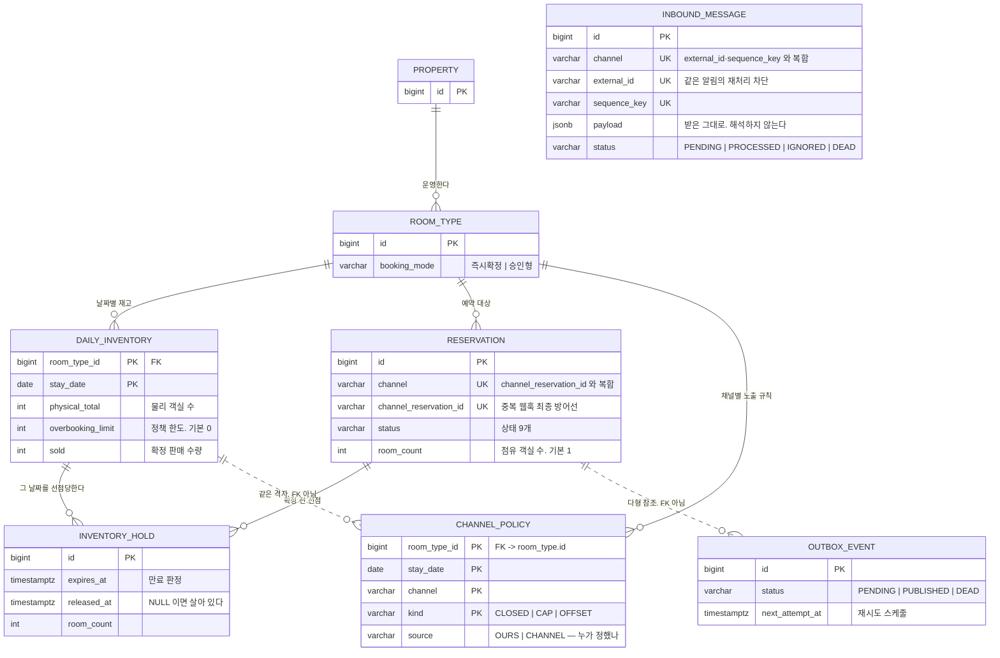
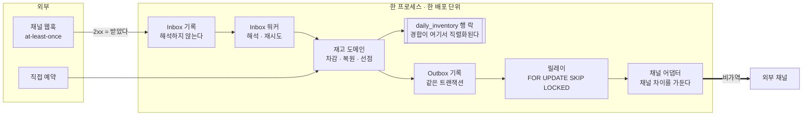

# stay-inventory-sync

다채널로 판매되는 숙박 재고의 **정합성**을 구조적으로 보장하는 최소 백엔드 실험.

기능의 폭이 아니라 **한 가지 문제를 끝까지 증명하는 것**을 목표로 한다.

## 무엇에 중점을 두었나

세 가지다. 여기 적는 것은 기능 목록이 아니다. **판단의 기준**이다.

**1. "했다" 가 아니라 "지우면 깨진다" 로 말한다.**
동시성 처리를 했다는 주장은 검증되지 않는다. 이 저장소는 방어마다
**그것을 지웠을 때 어떤 테스트가 실패하는지**를 짝지어 두고 실제로 지워서 확인했다
(→ [무엇이 증명됐는가](#무엇이-증명됐는가--그리고-무엇을-깨뜨려-확인했는가)).

**2. 규칙을 지키게 만들지 않고 어길 자리를 없앤다.**
*"락 순서를 지키자"* 는 리뷰로 지키는 규칙이다. 조건부 UPDATE 의 `rowcount` 를 봐야
다음 단계로 갈 수 있게 만들면 **순서를 어기려면 코드를 뒤집어야 한다.**
날짜 목록을 정렬해서 넘기지 않고 **생성 자체를 오름차순으로** 만들면 지울 정렬이 없다.
막을 수 없는 경로는 ArchUnit 이 컴파일·CI 에서 끊는다.

**3. 판단은 코드가 아니라 문서에 남는다.**
ADR 12개가 채택한 것과 **기각한 대안**을 함께 적는다. 구현 중 문서가 틀린 것이
드러나면 문서를 조용히 고치지 않고 **이슈로 올려 판단을 남긴 뒤** 고친다
(`#48` 이 그 사례다).

---

## 1. 문제 정의

숙박 사업자는 자사 채널과 다수의 OTA(에어비앤비, 야놀자 등)로 동일한 재고를 판매한다.
이 구조에서 두 종류의 불일치가 필연적으로 발생한다.

### (a) Dual-write

예약 저장(내부 DB)과 재고 반영(외부 채널 API)은 서로 다른 트랜잭션이다.
한쪽만 성공하면 이미 팔린 객실이 다른 채널에서 다시 팔린다.

### (b) 중복 수신

채널은 예약 웹훅을 at-least-once로 전달한다.
Channex(채널매니저) 기준으로 5XX 응답 시 최대 10회, 최종 시도가 원본 이벤트로부터 약 24시간 뒤까지 재시도된다.
방어가 없으면 예약 1건이 N건이 되고 재고가 과다 차감된다.

### 비용

두 경우 모두 결과는 **오버부킹**이다.
비용은 시스템이 아니라 현장이 지불한다. 환불, 룸 이동, CS 대응, 그리고 그 모든 것을 조율하는 사람의 시간.

### 어떤 오버부킹을 막는가

오버부킹은 두 종류이고 **이 프로젝트가 다루는 것은 뒤쪽 하나다.**

| | 성격 | 이 프로젝트 |
|---|---|---|
| **의도적** 오버부킹 | 수익관리 전략. 노쇼가 하루 5~15% 이고 안 팔면 소멸한다 | **막지 않는다.** 정책 한도로 표현한다 |
| **사고성** 오버부킹 | 동기화 오류·중복 수신·수기 실수 | **0 으로 만든다** |

그래서 `total` 을 `물리 객실 수 + 정책 한도` 로 정의한다 (`A8`, ADR-0007).
시스템은 여전히 정책이 허용한 선을 한 칸도 넘지 않는다. **넘을 수 있는 것은 의도치 않은 초과뿐이다.**

초과 판매를 구조적으로 금지하는 시스템은 실무에서 거부당한다.
거부당하면 현장이 우회 경로를 만들어 **"재고의 원본은 우리"라는 전제가 깨진다.**

### 왜 "확인 업무"부터 보았나

운영 자동화의 대상은 보통 수기 업무 · 확인 업무 · 병목으로 묶인다.
이 중 **확인 업무가 가장 많은 것을 말해준다.**

수기 업무는 도구가 아직 없는 것이다. 만들면 해결된다.
그러나 확인 업무는 **시스템이 이미 있는데도 그 결과를 믿지 못한다는 뜻**이다.
채널 재고를 사람이 매일 대조하고 있다면, 조직은 동기화가 틀릴 수 있음을 이미 알고 있다.

대조를 자동화하는 것은 증상을 빠르게 만들 뿐이다.
**확인이 필요 없어지려면 틀리지 않아야 한다.**

그래서 이 프로젝트는 감지가 아니라 **원인**부터 다룬다.
정합성이 보장된 뒤의 불일치 리포트는 예외 감지 장치가 된다. 일상 업무로 남지 않는다.

**본 프로젝트는 위 두 지점만을 대상으로 한다.**

### 무엇이 증명됐는가 — 그리고 무엇을 깨뜨려 확인했는가

이 저장소가 하는 주장은 *"동시성 처리를 했다"* 가 아니라 **"이 방어를 지우면 이 테스트가
실패한다"** 이다. 방어마다 실제로 지워 보고 확인했다.

| 지운 것 | 실패한 것 |
|---|---|
| 재고 행 락 (`FOR UPDATE` → `findById`) | `T1` 계열 3종 · `T2` |
| 조건부 UPDATE 의 `AND status = 'CONFIRMED'` | `T5` · `T5 확장` |
| 어댑터의 멱등키 흡수 | `T4` |
| 집기-임대 (`SKIP LOCKED`) | `B3` |
| 버전 스탬프 판정 | `B4` 계열 4종 |
| 레이트 리밋의 재시도 예산 면제 | DLQ 2종 |
| 순서 키의 `aggregate_type` | 레인 분리 |
| 조기 반환의 `IS NOT DISTINCT FROM` | 순서키 `null` 판정 |
| 엔티티 연관 매핑 금지 | ArchUnit |
| 불변식 훅 등록 (양쪽 엔진 각각) | 도달 테스트 2종 |

**그리고 그 반증이 통과한 적이 네 번 있었고 네 번 다 원인은 테스트였다.**
그때 무엇이 잘못돼 있었는지는 [`03-testing-strategy.md`](docs/03-testing-strategy.md)
「반증이 통과하면 반증 절차를 먼저 의심한다」에 표로 정리했다.

---

## 2. 가정

실제 운영 시스템의 내부 구조는 알 수 없으므로 다음을 전제했다.

| # | 가정 | 근거 / 영향 |
|---|---|---|
| A1 | 객실은 개별 호실이 아니라 **룸타입 단위**로 판매된다 | 업계 표준. 호실 배정은 체크인 시점 관심사로 분리 |
| A2 | 재고는 **날짜별 잔여 수량**으로 관리된다 | 다일 예약이 여러 행에 걸치는 구조를 만든다 |
| A3 | 모든 채널이 **하나의 공유 재고**를 바라본다 (pooled) | ADR-0001 참고 |
| A4 | 채널 API는 **at-least-once**로 웹훅을 보낸다 | Channex 공개 스펙 |
| A5 | 재고는 **선점(hold) 시점에 잡히고 확정 시점에 차감된다** | 선점은 `daily_inventory` 가 아니라 별도 테이블에서 센다. ADR-0010 |
| A6 | 요금(rate)은 재고와 독립적인 축이다 | 범위에서 제외 |
| A7 | 예약 1건은 **여러 객실을 점유할 수 있다** (`room_count`, 기본 1) | 다객실 예약을 범위 밖으로 두면 `UNIQUE(channel, channel_reservation_id)` 와 충돌한다. `docs/01-domain-model.md` 참고 |
| A8 | `total` 은 **물리 객실 수 + 정책 오버부킹 한도**다 (한도 기본 0) | 의도적 오버부킹과 사고성 오버부킹을 구분하기 위함. ADR-0007 |

---

## 3. 범위

### 만든 것

| 층 | 무엇 | 증명 |
|---|---|---|
| 도메인 | 8개 테이블 (+ 운영 1개) · 상태 전이표 · 불변식 4종 | `INV-1`~`INV-4` 를 **모든 테스트 종료 시** 검사 |
| 재고 | 다일 원자적 차감 · 취소 복원 | **`T1` `T2` `T5` `T6`** |
| 인바운드 | 웹훅 Inbox 수신 · 멱등 흡수 | **`T3`** |
| 아웃바운드 | Outbox 릴레이 · 채널 어댑터 · 백오프 | **`T4`** |
| 순서 | 키 단위 버전 스탬프 · 배치 병합 | `B4` |
| 다중 인스턴스 | 집기-임대 (`FOR UPDATE SKIP LOCKED`) | `B3` |
| 운영 | 재고 diff 리포트 · Outbox DLQ · 지표 3덩어리 | `B1` `B2` `B5` |
| 정책 | 채널별 노출 상한 (캡형 hybrid) | **`T11` `T12`** |
| 수렴 | 정기 재동기화 (키셋 커서 · 단일 실행 · 수동 트리거) | `B6` |

**테스트 223개** 중 **200개가 Testcontainers 위의 실제 PostgreSQL** 에서 돈다.
H2 를 쓰지 않는 이유는 `SELECT FOR UPDATE` 의 의미가 달라 **락 검증이 성립하지
않기 때문**이다.

나머지 23개는 DB 가 필요 없다 — 상태 전이표 12개와 ArchUnit 11개다.
**그 둘을 DB 없이 검사할 수 있다는 것이 `domain` / `persistence` 를 가른 이유**이며,
상태 규칙이 틀렸는지 보려고 컨테이너를 띄울 일이 없다.

### 만들지 않은 것

| 제외 | 이유 |
|---|---|
| 프론트엔드 | 백엔드 문제이며, 검증 대상은 API 계약과 정합성 |
| 인증/권한 | 문제 정의와 직교. 붙을 위치만 명시 |
| 요금 정책 엔진 | 재고 정합성과 독립적인 별개 문제 축 (A6) |
| 실제 OTA 연동 | 계약·인증 필요. 공개 스펙을 모방한 스텁으로 대체 |
| 배포 / IaC | 3일 내 검증 불가. 로컬 재현성만 보장 |
| Kafka | ADR-0004에 도입 조건과 마이그레이션 경로 기술 |

범위 판단의 전체 근거는 `docs/02-scope.md`.

---

## 4. 데이터 모델

테이블 **8개**다. 관계와 키만 먼저 본다 — 컬럼까지 있는 ERD 는
[`docs/01-domain-model.md`](docs/01-domain-model.md) 에 있다.



**실선(`--`)은 DB FK 로 강제되는 관계, 점선(`..`)은 키를 공유하거나 논리적으로만 이어진
관계다.** `channel_policy` 를 `daily_inventory` 에 FK 로 묶으면 **재고 행이 아직 없는 미래
날짜에 노출 상한을 미리 설정하는 것이 막힌다** (캡형 운영에서 실제로 필요한 동작이다).

### 이 그림에서 봐야 할 다섯 가지

**① `total` 컬럼이 없다.** `physical_total` 과 `overbooking_limit` 두 개이고
합계는 계산값이다. 하나로 합치면 지표 · 경고 · 되돌림 셋을 동시에 잃는다
([ADR-0007](docs/adr/0007-overbooking-policy.md)).

**② `sold` 는 최적화가 아니라 경합의 직렬화 지점이다.** 예약 테이블을 매번 집계하면
"잔여 1개에 100명이 동시 요청"을 막을 자리가 없다. 카운터가 있는 행을 잠가야 직렬화된다.

**③ 세 개의 `UNIQUE` 가 멱등성을 DB 에 맡긴다.** 애플리케이션이 아니라 제약이 판정한다.

```text
reservation      UNIQUE(channel, channel_reservation_id)          중복 웹훅
inbound_message  UNIQUE NULLS NOT DISTINCT                        같은 알림 재처리
                   (channel, external_id, sequence_key)
channel_policy   PK(room_type_id, stay_date, channel, kind)       규칙 중복
```

`inbound_message` 의 `NULLS NOT DISTINCT` 가 빠지면 **제약이 아무것도 막지 못한다.**
`sequence_key` 는 NULL 일 수 있고(순서키를 주지 않는 채널이 있다) PostgreSQL 에서
기본적으로 **NULL 은 NULL 과 같지 않다.** 순서키를 주지 않는 채널에서만 멱등이 뚫리므로
조용하다. `NULLS NOT DISTINCT` 는 PostgreSQL 15 이상이며 이것이 스택 하한을 고정한다.

**④ `INBOUND_MESSAGE` 에 선이 하나도 없는 것은 의도한 것이다.**
`kind` 가 `BOOKING` 이면 `reservation` 을, `POLICY` 면 `channel_policy` 를 가리킨다 —
**다른 테이블이고 개수도 다르다.**

```text
BOOKING  ->  reservation      0~1 건
POLICY   ->  channel_policy   0~N 건
             (room_type_id, stay_date, channel, kind) 에서 kind 별로 여러 행
```

컬럼 하나는 **다른 테이블도, 집합도** 가리킬 수 없다. 그리고 에코와 해석 실패는
**끝까지 대상이 없는 것이 정상**이다. `payload` 는 받은 그대로 두고 무엇을 가리키는지는
해석의 산출물로 따로 둔다.

> nullable FK 로 저장 자체는 가능하다. FK 는 값이 있을 때만 검사하므로
> **"FK 를 걸면 저장할 수 없다"는 근거가 아니다.** 안 두는 이유는 위와 같다
> (`docs/01-domain-model.md`).

**⑤ `sequence_key` 는 NULL 일 수 있고 그래서 `NULLS NOT DISTINCT` 가 필요하다.**
PostgreSQL 에서 기본적으로 NULL 은 NULL 과 같지 않다. 빼면 순서키를 주지 않는 채널에서만
멱등이 뚫리므로 **조용하다** — 순서키를 주는 채널로 테스트하면 통과한다.

### 불변식

이 테이블들이 지켜야 하는 것을 넷으로 적는다. 테스트가 실제로 검사하는 대상이다.

**`total` 은 컬럼이 아니라 `physical_total + overbooking_limit` 계산값이다.**
불변식 서술에는 `total` 을 쓰고, DB `CHECK` 와 마이그레이션에는 **실제 컬럼 두 개**를 쓴다.
`CHECK (sold <= total)` 로 쓰면 첫 마이그레이션에서 실패한다.

| | 내용 | 판정 |
|---|---|---|
| `INV-1` | `0 <= sold <= total` | DB `CHECK` — 제약에는 실제 컬럼 두 개를 쓴다 |
| `INV-2` | `sold == SUM(점유 예약의 room_count)` | **상태만으로** 결정된다 |
| `INV-3` | `check_in < check_out` | DB `CHECK` |
| `INV-4` | `sold + SUM(유효 선점의 room_count) <= total` | **상태만으로는 부족하다** |

`INV-2` 와 `INV-4` 의 차이가 이 모델에서 가장 자주 틀리는 지점이다.
점유는 상태 하나로 결정되지만(`CONFIRMED` · `CHECKED_IN` · `CHECKED_OUT` · `TERMINATED`)
**유효 선점은 상태에 더해 `expires_at > now() AND released_at IS NULL` 이 필요하다.**
상태만 세면 만료된 선점까지 세어 잔여가 실제보다 적게 나온다.

**JPA 연관 매핑은 두지 않는다.** 이 그림은 데이터의 모양이고 코드에서 참조는 ID 값으로만
한다 ([ADR-0008](docs/adr/0008-jpa-with-explicit-writes.md)).

---

## 5. 구조 — 한 프로세스, 세 경계

모놀리식이다. **쪼개지 않은 것이 판단이고, 대신 경계를 그었다.**
경계를 사람이 지키게 하지 않고 ArchUnit 이 CI 에서 끊는다.



**세 경계가 각각 다른 것을 막는다.**

| 경계 | 가르는 것 | 없으면 |
|---|---|---|
| **Inbox** | 수신 ↔ 해석 | 해석 실패가 "받은 사실" 을 지운다 |
| **Outbox** | 도메인 커밋 ↔ 외부 호출 | dual-write — 유실 또는 유령 |
| **어댑터** | 채널 차이 ↔ 도메인 | 채널이 하나 늘 때 도메인이 바뀐다 |

**경합은 전부 `daily_inventory` 행 락 하나로 직렬화된다.** 락 순서는
`reservation → daily_inventory`, 날짜는 오름차순으로 고정이며 이 순서가
데드락을 구조적으로 불가능하게 만든다 (ADR-0011).

**어댑터 밖으로 나간 쓰기는 회수할 수 없다.** 그래서 취소·중복·재시도 판정은
발행 시점이 아니라 **소비 시점**에 둔다.

### 패키지 구조

```
domain/       상태 기계와 값 집합. JPA·웹 어노테이션을 모른다
persistence/  @Entity 8개와 리포지토리. 이 시스템에서 JPA 는 행 매퍼로만 쓰인다
```

둘을 가른 이유는 취향이 아니라 **아키텍처 규칙 하나**다 —
*"domain 패키지는 spring-web, jpa 어노테이션에 의존하지 않는다"*
([`03-testing-strategy.md`](docs/03-testing-strategy.md)). 엔티티를 `domain` 에 두면
그 규칙이 성립할 수 없다. 성립하지 않는 규칙을 적어 두면 장식만 남는다.

가르고 나면 전이표를 **DB 없이** 단위 테스트로 고정할 수 있다는 것이 부수 효과다.
상태 규칙이 틀렸는지 보려고 컨테이너를 띄울 이유가 없다.

### 쪼갤 때 잘리는 선

지금 쪼개지 않은 이유는 규모다. 쪼갤 때가 오면 **위 그림의 굵은 선이 그대로
프로세스 경계가 된다** — 릴레이와 워커는 이미 폴링 기반이고 도메인을 직접
호출하지 않는다. Kafka 도입 조건과 마이그레이션 경로는 ADR-0004 에 적었다.

---

## 6. 장애와 회복

**막는 것만 적으면 이 절은 자랑이 된다.** 못 막는 것을 같은 무게로 적는다.
전체는 [`08-failure-and-recovery.md`](docs/08-failure-and-recovery.md).

| 실패 | 방어 | 회복 | |
|---|---|---|---|
| 예약 요청이 애매하게 끝남 | 재고 이중 차감은 `UNIQUE` 가 막는다 | — | **부분** |
| 저장·통보 한쪽만 성공 | Outbox — 같은 트랜잭션 | 릴레이 재발행 | 완결 |
| 외부 채널 장애 | 429 · 5xx · 4xx 를 **다르게** 다룬다 | 백오프 · DLQ · 수동 재투입 | 완결 |
| 채널과 숫자가 어긋남 | 키 단위 버전 스탬프 | diff 리포트 · 재동기화(**키셋 커서**) | 완결 |
| 인바운드 **중복** | Inbox 3중 멱등 | 워커 재시도 | 완결 |
| 인바운드 **순서** | rank 정렬 + 묘비 | — | 완결 (rank null 채널 제외) |
| DB 장애 | `lock_timeout` · 풀 상한 | — | **부분** |
| 인스턴스 증가 | 릴레이·재동기화는 임대 (Inbox 워커는 없음) | — | **부분** |

### 판단 기준은 "시끄러운가 조용한가" 다

시끄러운 실패는 재시도와 알림으로 처리한다. **조용한 실패는 구조로 막거나,
막을 수 없으면 검출 장치를 둔다.**

가장 조용한 실패가 **응답이 `Success` 인데 채널에 반영되지 않은 경우**다.
재시도도 로그도 알림도 없다. 그것을 잡는 것이 diff 리포트이고,
테스트가 그 상황을 주입해서 확인한다 —
*"어댑터가 조용히 누락한 날짜를 잡아낸다 — 실패도 예외도 없었다"*.

### 실패를 한 덩어리로 다루지 않는다

```
RateLimited (429)  →  retry_count 를 올리지 않는다.  DEAD 로 절대 안 간다
Retryable  (5xx)   →  1/2/4/8/15/30분 백오프.        5회 넘으면 DEAD
Permanent  (4xx)   →  즉시 DEAD
```

**소진 판정은 "몇 번 실패했는가" 이지 "몇 번 미뤘는가" 가 아니다.**
이 구분이 없던 시절의 결함이 아래 「부딪힌 것」 4번이다.

### 리뷰가 두 판정을 반증했다

이 절을 처음 쓸 때 「채널과 숫자 어긋남」과 「인바운드 순서」를 **완결로 적었고
둘 다 틀렸다.**

- **재동기화는 격자의 앞 500건만 반복했다** — 커서가 없었다. 최종 방어선이
  부분만 덮고 있었다. **`#71` `#67` 로 닫았다** (키셋 커서 · 임대 · 수동 트리거)
- **순서키 정렬이 문자열 정렬이다** — 숫자 리비전 `10` 이 `2` 보다 먼저 처리된다.
  **순서 역전을 막으려는 정렬이 역전을 만든다** (`#72`)

방어선을 만든 사람이 그 방어선의 범위를 확인하지 않은 것이다.
지우지 않고 남긴다 — 무엇을 확인하지 않았는지가 이 절의 값이다.

### 가장 큰 구멍을 먼저 적는다

`channelReservationId` 를 안 주는 직접 예약은 서버가 요청마다 UUID 를 만든다.
**그래서 타임아웃 후 재시도가 중복 예약이 된다.** `UNIQUE` 는 살아 있는데
판정 대상이 사라진 경우다 — **멱등은 서버가 혼자 만들 수 없다.**
같은 저장소의 웹훅 경로는 이 문제를 이미 3중으로 풀었고, 그 비대칭이 `#64` 이다.

공백 여덟 개와 각각의 착수 조건은
[`08-failure-and-recovery.md`](docs/08-failure-and-recovery.md) §9 에 있다.

---

## 7. 운영 — 무엇을 보고 무엇을 누르나

"확인 업무를 없앤다" 가 목표였으므로 **남은 개입은 예외여야 하고,
그 예외에는 경로가 있어야 한다.**

| 신호 | 어디서 | 무엇을 누르나 |
|---|---|---|
| DEAD 가 쌓인다 | `/ops/metrics` 의 `dead` | `/ops/outbox/dead` → `/ops/outbox/{id}/retry` |
| 발행 지연이 길어진다 | `outboxPublishLag` 의 `p95` · `max` | 채널 상태 확인. 429 면 기다린다 |
| 통보가 아예 안 나간다 | `outboxBacklog.oldestPendingAgeSeconds` | 릴레이 생존 확인 |
| 채널과 숫자가 다르다 | `/ops/inventory-diff` | 원인 판정 → **`/ops/resync` 로 즉시 수렴** 또는 캡 조정 |
| 특정 채널만 과판매된다 | `overbookingPrevented` | `/ops/channel-policy` 로 캡 조정 |

**평균을 내지 않는다.** 재고 통보의 지연은 꼬리가 문제이고 평균은 그 소수를 지운다.
**backlog 를 따로 낸다.** 발행된 것만으로 분포를 내면 **영원히 안 나가는 이벤트가
쌓일 때 분포가 오히려 좋아 보인다.**

운영 API 는 도메인 API 와 가른다. 그리고 **`DELETE /ops/channel-policy` 는 일부러
멱등이 아니다** — 걸린 캡이 없으면 404 다. 200 을 주면 운영자가 "해제했다" 고 믿는데
실제로는 애초에 걸린 적이 없다. **부르는 주체가 기계가 아니라 사람일 때는
멱등이 오히려 거짓말이 된다.**

**임계값은 아직 없다.** 어느 값을 넘으면 사람을 불러야 하는지가 정해져 있지 않다 (`#68`).
헬스체크도 없다 (`#69`).

---

## 8. 구현하면서 부딪힌 것 — 증상 · 원인 · 해결 · 결과

설계에서 나온 것은 빼고 **구현하면서 드러난 것**만 적는다. 여섯 건 모두 테스트가 먼저 알려 줬다.

### (1) 문서가 약속한 반증 절차가 구현에 닿지 않았다

**증상** — `T2`(다일 예약 데드락 부재)는 *"정렬 로직을 제거하면 즉시 실패해야 한다"* 로
유효성이 정의돼 있었다. 그런데 **그 조작을 할 수가 없었다.**

**원인** — 날짜 목록이 `generateSequence(checkIn) { it.plusDays(1) }` 로 만들어져
**생성 자체가 오름차순**이다. 지울 `sorted()` 한 줄이 없다. 더 근본적으로,
두 스레드를 **모두** 내림차순으로 바꿔도 데드락은 나지 않는다 —
데드락에 필요한 것은 오름차순이 아니라 **순서의 일치**이고 코드 경로가 하나면
그 경로를 어떻게 바꿔도 순서는 언제나 일치한다.

**해결** — 구현을 반증 가능하게 되돌리는 안은 기각했다. *반증하려고 어길 수 있는
자리를 만드는 것은 본말전도다.* 대신 증명을 셋으로 나눴다.

```text
순서가 어긋나면 데드락이 난다   래치로 교차, SQLSTATE 40P01 확정 재현
같은 순서면 안 난다             같은 두 행, 순서만 일치. 둘 다 커밋
이 구현은 어긋날 수 없다        실제 서비스 200회 교차 + stayDates() 단위 테스트
```

**결과** — `40P01`(데드락)과 `55P03`(락 타임아웃)을 구분해 단언한다. 구분하지 않으면
*"순환"* 과 *"느렸다"* 를 같은 것으로 보고하게 되고 그 상태로는 `lock_timeout` 값을
바꿀 때 무엇이 깨지는지 알 수 없다. 문서에는 원래 문장을 **지우지 않고** 남긴 뒤
왜 성립하지 않는지를 아래에 적었다.

### (2) 반증 실험이 통과했다 — 예외가 `Future` 안에 갇혀 있었다

**증상** — 중복 취소 방어(`AND status = 'CONFIRMED'`)를 지웠는데 「T5 확장」이 **통과**했다.

**원인** — 복원이 한 번만 일어나서가 아니었다. 초과 복원이 `CHECK (sold >= 0)` 에 걸려
예외로 죽었고 그 예외가 `pool.submit` 의 `Future` 안에 갇혀 **아무 데도 나타나지
않았다.** 테스트는 초록불인데 절반이 죽어 있었고 그 상태로 나온 숫자를 근거로
*"정확히 5건"* 을 주장하고 있었다.

**해결** — 동시성 헬퍼를 공용으로 빼고 **새어 나온 예외를 모아 실패로 만든다.**

**결과** — 고친 뒤 다시 지우니 `T5` 와 `T5 확장`이 **둘 다** 실패했다. 이 구멍을 그냥
넘겼다면 이후 모든 동시성 테스트가 같은 방식으로 조용히 약해졌을 것이다.

### (3) 방어선이 겹쳐서 앞엣것의 생사가 관측되지 않았다

**증상** — 웹훅 중복 판정의 `IS NOT DISTINCT FROM` 을 `=` 로 바꿨는데 테스트가 전부 통과했다.

**원인** — 조기 반환이 죽어도 `INSERT` 가 DB `UNIQUE` 에 걸리고 그 예외를 잡아
**똑같이 `Duplicate` 를 돌려준다.** 두 방어선이 같은 결과를 내므로 결과만 봐서는
앞엣것이 살아 있는지 알 수 없다.

**해결** — 관측 가능한 결과 대신 **판정 쿼리 자체**를 보는 테스트를 추가했다.

**결과** — 반증이 성립했다. 그리고 이 결함은 성능 문제가 아니다. 조기 반환이 죽으면
**정상 경로가 매번 DB 예외로 끝나고** 진짜 이상이 그 예외 노이즈에 묻힌다.
`sequence_key` 가 `null` 인 채널에서만 뚫리므로 순서키를 주는 채널로 테스트하면
영영 안 보인다. 스키마의 `NULLS NOT DISTINCT` 가 막으려던 것과 **같은 함정이
애플리케이션 쪽에도 있었다.**

### (4) 아무도 안 쓰던 한 줄이, 기능 하나로 정상 이벤트를 죽이는 경로가 됐다

**증상** — Outbox 릴레이가 `RateLimited`(429)에서도 `retry_count` 를 올리고 있었다.
`#4` 시점에는 그 값을 아무도 읽지 않아 무해했다.

**원인** — DLQ(`retry_count > 5 → DEAD`)를 그 위에 얹는 순간 의미가 바뀐다.

```text
성수기 → 예약 폭증 → 통보 폭증 → 429 반복 → retry_count 초과 → DEAD
```

**사장님이 예약을 많이 받았다는 이유로 통보가 죽는다.** 그리고 조용하다 —
채널은 아무 문제도 보고하지 않았고 우리 로그에는 *"재시도 소진"* 만 남는다.

**해결** — 소진 판정은 *"몇 번 실패했는가"* 이지 *"몇 번 미뤘는가"* 가 아니다.
`scheduleRetry(countAsFailure)` 로 갈라 레이트 리밋에서만 껐다.

**결과** — 429 를 20번 받아도 `DEAD` 로 가지 않는 것을 테스트로 고정했다.
**기능을 더할 때 바뀌는 것은 대개 "아무도 안 쓰던 값" 이다.**

### (5) 정책 통보와 재고 통보가 같은 순서 키를 공유했다

**증상** — 채널별 노출 상한(캡)을 Outbox 로 투영했더니, **캡을 바꿨다는 이유로
재고 통보가 건너뛰어졌다.**

**원인** — 순서 판정 키가 `(room_type_id, stay_date)` 인데 **정책 통보도 같은 격자를 쓴다.**
버전이 큰 쪽이 작은 쪽을 낡은 것으로 만든다.

**해결** — 키를 `(aggregate_type, room_type_id, stay_date)` 로 넓혔다.
`aggregate_type` 은 이미 있는 컬럼이라 **마이그레이션이 필요 없다.**

**결과** — 그리고 여기서 원래 결정(`ADR-0012`)의 성질이 다시 드러났다.
버전의 단조성을 보장하는 것은 시퀀스가 아니라 **이미 있는 행 락**이다.
재고는 `daily_inventory` 행 락이, 정책은 `channel_policy` 행 락(`ON CONFLICT` 가 잡는다)이
직렬화한다. 그래서 `ChannelPolicyService` 는 **upsert 를 버전 계산보다 먼저** 한다.
**축이 늘 때마다 그 축의 직렬화 지점을 찾아야 한다**는 것을 ADR 에 적었다.

### (6) 마지막 방어선이 막으려던 창의 방향을 잘못 짚었다

**증상** — 정기 재동기화(`B6`)가 닫아야 할 창을 재현했는데 **테스트가 통과했다.**

**원인** — *"낡은 통보의 마킹이 유실되는"* 시나리오로 짰는데, **그쪽은 이미 `B4` 가 막는다.**
더 새로운 `PUBLISHED` 가 있으므로 skip 된다. 창이 열리는 쪽은 반대였다.

```text
새 통보가 채널에 도달 → 마킹 전 릴레이 종료 → PENDING 으로 남음
낡은 통보가 나중에 잡힘 → "더 큰 PUBLISHED 없음" → 발행 → 낡은 값이 새 값을 덮는다
```

**해결** — 방향을 바로잡아 재현하니 낡은 값이 새 값을 실제로 덮었고 재동기화가
그것을 되돌리는 것까지 확인됐다.

**결과** — 이슈 본문의 그림은 *어느 쪽 통보인지*를 말하지 않았다. 그대로 짰다면
**`B4` 가 고친 것을 재동기화가 고쳤다고 믿었을 것이다.**

---

### 여섯 건에서 반복된 것

| 반복된 실패 형태 | 어디서 |
|---|---|
| **예외가 사라진다** — 스레드·비동기 경계에서 실패가 조용해진다 | (2) |
| **방어선이 겹친다** — 뒤엣것이 같은 결과를 내면 앞엣것의 생사가 안 보인다 | (3) |
| **경계값이 우연히 같다** — 비교 연산이 아예 발동하지 않는 픽스처 | (5) |
| **막힌 것을 재현한다** — 이미 다른 방어가 잡고 있는 경우를 시험한다 | (6) |

**반증 실험이 통과하면 두 가지 중 하나다** — 방어가 불필요했거나, **반증 절차가
틀렸거나.** 네 번 다 후자였다. 자세한 표는
[`03-testing-strategy.md`](docs/03-testing-strategy.md) 「반증이 통과하면 반증 절차를
먼저 의심한다」에 있다.

그 밖에 짧게 적어 둘 것 둘.

- **`@Transactional` 자기 호출** — 워커가 같은 빈의 처리 메서드를 부르면 프록시를
  거치지 않아 트랜잭션이 통째로 무시되는데, **단건 처리에서는 결과가 같아 보여
  테스트가 통과한다.** 빈을 나눠 그 경로 자체를 없앴다
- **`jsonb` 정규화** — PostgreSQL 은 `jsonb` 를 저장하며 키 순서를 바꾸고 공백을
  넣는다. `"removed":true` 로 문자열 매칭하면 **저장 후에는 맞지 않아** 조용히
  `false` 가 된다. payload 는 파싱해서 읽는다

---

## 9. 기술 스택

```
Kotlin 2.x + Spring Boot 3.x + JDK 21
PostgreSQL 16 + Flyway
Kotest + Testcontainers + Awaitility + ArchUnit
```

Kotlin은 의도적으로 **좁은 부분집합만** 사용한다.
`data class`, `sealed interface`, null 안전성, `val` 기본까지.
코루틴, DSL, `inline reified`, context receivers는 쓰지 않는다.
사용/미사용 목록과 근거는 [ADR-0005](docs/adr/0005-kotlin-subset.md).

가상 스레드도 켜지 않는다. 이 워크로드의 상한은 스레드가 아니라 커넥션 풀이므로
기여하지 않는다. 근거는 [ADR-0006](docs/adr/0006-no-virtual-threads.md).

JPA 엔티티에는 `data class`를 쓰지 않는다. 이유도 ADR-0005에 있다.

JPA는 쓰되 **엔티티 간 연관 매핑을 두지 않는다.** dirty checking이 아키텍처 규칙을 우회해
재고를 바꾸는 경로를 만들기 때문이다. 채택 근거와 기각한 대안(jOOQ, R2DBC 등)은
[ADR-0008](docs/adr/0008-jpa-with-explicit-writes.md).

H2는 사용하지 않는다. `SELECT FOR UPDATE`의 동작이 PostgreSQL과 달라
락 검증이 성립하지 않기 때문이다.

---

## 10. 실행

### 준비 — Gradle 은 **JDK 21 로 실행한다**

```bash
export JAVA_HOME=$(/usr/libexec/java_home -v 21)   # macOS
```

**`build.gradle.kts` 의 `jvmToolchain(21)` 은 이것을 대신하지 못한다.** 툴체인은
컴파일에 쓰는 JDK 만 고르고 **Gradle 자신과 Kotlin 플러그인은 `JAVA_HOME` 의 JVM 에서
돈다.** 상위 JDK(예: 25)에서는 Gradle 8.14 가 빌드 스크립트를 컴파일하다가 죽는다.

그때 나오는 메시지가 이것뿐이다.

```text
* What went wrong:
25.0.1
```

**원인을 한 글자도 알려주지 않는다.** 이 숫자만 나오면 JVM 버전 문제다.
스크립트가 실행되기 전에 죽으므로 빌드 안에 가드를 둘 수 없다. 그래서 문서에 적는다.
CI 는 `actions/setup-java` 로 21 을 넣으므로 이 문제를 만나지 않는다.

### 테스트

```bash
./gradlew test
```

**Docker 만 떠 있으면 된다. `docker compose` 는 필요하지 않다.**
Testcontainers 가 실행마다 격리된 PostgreSQL 16 을 띄운다. 테스트가 로컬 DB 상태에
의존하면 "내 로컬에서는 통과" 가 생긴다.

테스트가 전부 통과하면 이 프로젝트가 주장하는 것이 증명된 것이다.

### 애플리케이션

```bash
docker compose up -d
./gradlew bootRun
```

`docker-compose.yml` 은 **로컬에서 앱을 띄울 때만** 쓴다. 이미지는 `postgres:16-alpine` 로
고정한다 — `inbound_message` 의 `UNIQUE NULLS NOT DISTINCT` 가 PostgreSQL 15 이상
기능이므로 이 하한은 선택이 아니다. `PostgresCapabilityTest` 가 이 전제를 실행해서 확인한다.

---

## 11. 문서

| 문서 | 내용 |
|---|---|
| [00-problem-definition](docs/00-problem-definition.md) | 문제 정의 상세 |
| [01-domain-model](docs/01-domain-model.md) | ERD, 상태 전이, 불변식 |
| [02-scope](docs/02-scope.md) | 범위 판단과 절단 기준 |
| [03-testing-strategy](docs/03-testing-strategy.md) | 테스트가 증명하는 것 |
| [04-capacity-and-limits](docs/04-capacity-and-limits.md) | 진짜 병목은 어디인가 |
| [05-ai-collaboration](docs/05-ai-collaboration.md) | AI 협업의 경계와 판단 기록 |
| [06-backlog](docs/06-backlog.md) | 우선순위와 착수 기준 |
| [07-reconciliation](docs/07-reconciliation.md) | 채널과의 대사 설계 · Inbox · 에코 판별 |
| [08-failure-and-recovery](docs/08-failure-and-recovery.md) | **장애 여덟 갈래 · 회복 경로 · 아직 비어 있는 것** |
| [09-how-to-verify](docs/09-how-to-verify.md) | **주장마다 어떤 명령으로 확인하나** |
| [ADR](docs/adr/) | 설계 결정과 **기각한 대안** (`0001`~`0013`. `0008` 은 영속성 매핑 계층, `0012`·`0013` 은 순서) |
| [AGENTS.md](AGENTS.md) | 코딩 에이전트용 규약 (`CLAUDE.md`는 심볼릭 링크) |
| [CONTRIBUTING.md](CONTRIBUTING.md) | 사람용 진입점 — 읽는 순서, 라벨·마일스톤 체계, PR 규약 |

---

## 12. 참고자료

코드는 참조하지 않았다. 도메인 이해와 외부 스펙 확인 목적으로만 조사했다.

### 상용 서비스 공개 스펙 (오픈소스 아님)

**Channex** — PMS 제공자를 대상으로 하는 화이트라벨 채널매니저 API. 영국 법인, B2B 도매 전용.
소스는 비공개이나 파트너 연동을 위해 API 문서를 공개한다.
본 프로젝트는 **코드가 아니라 계약(스펙)을 참조했다.**

- [API 문서](https://docs.channex.io/) — 레이트 리밋, 웹훅 재시도 스케줄, 델타 동기화 원칙
- [PMS 인증 테스트](https://docs.channex.io/api-v.1-documentation/pms-certification-tests) — 연동 승인 조건으로 큐/아웃박스, 백오프, 매핑 레이어를 요구
- [베스트 프랙티스](https://docs.channex.io/guides/best-practices-guide) — Feed 폴링 + ack 모델

이 문서들을 근거로 삼은 이유는, 이것이 **200개 이상의 PMS가 라이브 전에
통과해야 하는 실제 인증 기준**이기 때문이다. 누군가의 설계 의견이 아니다.

### 오픈소스

- [HAIP](https://github.com/TelivityAI/haip) — API-first 호텔 PMS (TypeScript/NestJS). 도메인 용어 참고
- [QloApps](https://github.com/Qloapps/QloApps) — PHP 기반 PMS. 스키마 구조만 참고
- [miniCal channex-integration](https://github.com/minical/channex-integration) — 오픈소스 PMS의 채널매니저 연동 흐름 참고

### 이 조사에서 얻은 판단

조사한 오픈소스 PMS는 공통적으로 기능의 폭으로 승부하며
채널 동기화는 cron 폴링으로 처리하고 정합성 검증은 명시적으로 수행하지 않는다.
반면 상용 채널매니저의 인증 기준은 **큐/아웃박스와 멱등성을 전제 조건으로 요구한다.**

이 격차가 본 프로젝트의 문제 선정 근거다.
