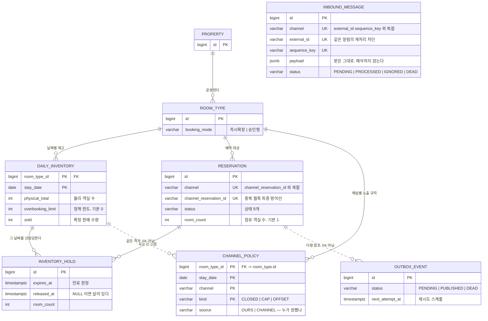

# stay-inventory-sync

다채널로 판매되는 숙박 재고의 **정합성**을 구조적으로 보장하는 최소 백엔드 실험.

기능의 폭이 아니라 **한 가지 문제를 끝까지 증명하는 것**을 목표로 한다.

---

## 1. 문제 정의

숙박 사업자는 자사 채널과 다수의 OTA(에어비앤비, 야놀자 등)로 동일한 재고를 판매한다.
이 구조에서 두 종류의 불일치가 필연적으로 발생한다.

### (a) Dual-write

예약 저장(내부 DB)과 재고 반영(외부 채널 API)은 서로 다른 트랜잭션이다.
한쪽만 성공하면 이미 팔린 객실이 다른 채널에서 다시 팔린다.

### (b) 중복 수신

채널은 예약 웹훅을 at-least-once로 전달한다.
Channex(채널매니저) 기준으로 5XX 응답 시 최대 10회, 최종 시도가 원본 이벤트로부터 약 24시간 뒤까지 재시도된다.
방어가 없으면 예약 1건이 N건이 되고 재고가 과다 차감된다.

### 비용

두 경우 모두 결과는 **오버부킹**이다.
비용은 시스템이 아니라 현장이 지불한다 — 환불, 룸 이동, CS 대응, 그리고 그 모든 것을 조율하는 사람의 시간.

### 어떤 오버부킹을 막는가

오버부킹은 두 종류이고 **이 프로젝트가 다루는 것은 뒤쪽 하나다.**

| | 성격 | 이 프로젝트 |
|---|---|---|
| **의도적** 오버부킹 | 수익관리 전략. 노쇼가 하루 5~15% 이고 안 팔면 소멸한다 | **막지 않는다.** 정책 한도로 표현한다 |
| **사고성** 오버부킹 | 동기화 오류·중복 수신·수기 실수 | **0 으로 만든다** |

그래서 `total` 을 `물리 객실 수 + 정책 한도` 로 정의한다 (`A8`, ADR-0007).
시스템은 여전히 정책이 허용한 선을 한 칸도 넘지 않고, **넘을 수 있는 것은 의도치 않은 초과뿐이다.**

초과 판매를 구조적으로 금지하는 시스템은 실무에서 거부당하고,
거부당하면 현장이 우회 경로를 만들어 **"재고의 원본은 우리"라는 전제가 깨진다.**

### 왜 "확인 업무"부터 보았나

운영 자동화의 대상은 보통 수기 업무 · 확인 업무 · 병목으로 묶인다.
이 중 **확인 업무가 가장 많은 것을 말해준다.**

수기 업무는 도구가 아직 없는 것이다. 만들면 해결된다.
그러나 확인 업무는 **시스템이 이미 있는데도 그 결과를 믿지 못한다는 뜻**이다.
채널 재고를 사람이 매일 대조하고 있다면, 조직은 동기화가 틀릴 수 있음을 이미 알고 있다.

대조를 자동화하는 것은 증상을 빠르게 만들 뿐이다.
**확인이 필요 없어지려면 틀리지 않아야 한다.**

그래서 이 프로젝트는 감지가 아니라 **원인**부터 다룬다.
정합성이 보장된 뒤의 불일치 리포트는 일상 업무가 아니라 예외 감지 장치가 된다.

**본 프로젝트는 위 두 지점만을 대상으로 한다.**

---

## 2. 가정

실제 운영 시스템의 내부 구조는 알 수 없으므로 다음을 전제했다.

| # | 가정 | 근거 / 영향 |
|---|---|---|
| A1 | 객실은 개별 호실이 아니라 **룸타입 단위**로 판매된다 | 업계 표준. 호실 배정은 체크인 시점 관심사로 분리 |
| A2 | 재고는 **날짜별 잔여 수량**으로 관리된다 | 다일 예약이 여러 행에 걸치는 구조를 만든다 |
| A3 | 모든 채널이 **하나의 공유 재고**를 바라본다 (pooled) | ADR-0001 참고 |
| A4 | 채널 API는 **at-least-once**로 웹훅을 보낸다 | Channex 공개 스펙 |
| A5 | 재고는 **선점(hold) 시점에 잡히고 확정 시점에 차감된다** | 선점은 `daily_inventory` 가 아니라 별도 테이블에서 센다. ADR-0010 |
| A6 | 요금(rate)은 재고와 독립적인 축이다 | 범위에서 제외 |
| A7 | 예약 1건은 **여러 객실을 점유할 수 있다** (`room_count`, 기본 1) | 다객실 예약을 범위 밖으로 두면 `UNIQUE(channel, channel_reservation_id)` 와 충돌한다. `docs/01-domain-model.md` 참고 |
| A8 | `total` 은 **물리 객실 수 + 정책 오버부킹 한도**다 (한도 기본 0) | 의도적 오버부킹과 사고성 오버부킹을 구분하기 위함. ADR-0007 |

---

## 3. 범위

### 만든 것

- 도메인 모델 8개 테이블 (`docs/01-domain-model.md`)
- 예약 생성 API — 다일 재고의 원자적 차감
- 예약 취소 API — 재고 복원
- Outbox 테이블 + 릴레이
- `ChannelAdapter` 인터페이스 + 스텁 2종
- 채널 웹훅 수신 — 멱등 처리
- **안정성 테스트 4종** (`docs/03-testing-strategy.md`)

### 만들지 않은 것

| 제외 | 이유 |
|---|---|
| 프론트엔드 | 백엔드 문제이며, 검증 대상은 API 계약과 정합성 |
| 인증/권한 | 문제 정의와 직교. 붙을 위치만 명시 |
| 요금 정책 엔진 | 재고 정합성과 독립적인 별개 문제 축 (A6) |
| 실제 OTA 연동 | 계약·인증 필요. 공개 스펙을 모방한 스텁으로 대체 |
| 배포 / IaC | 3일 내 검증 불가. 로컬 재현성만 보장 |
| Kafka | ADR-0004에 도입 조건과 마이그레이션 경로 기술 |

범위 판단의 전체 근거는 `docs/02-scope.md`.

---

## 4. 데이터 모델

테이블 **8개**다. 관계와 키만 먼저 본다 — 컬럼까지 있는 ERD 는
[`docs/01-domain-model.md`](docs/01-domain-model.md) 에 있다.



**실선(`--`)은 DB FK 로 강제되는 관계, 점선(`..`)은 키를 공유하거나 논리적으로만 이어진
관계다.** `channel_policy` 를 `daily_inventory` 에 FK 로 묶으면 **재고 행이 아직 없는 미래
날짜에 노출 상한을 미리 설정하는 것이 막힌다** — 캡형 운영에서 실제로 필요한 동작이다.

### 이 그림에서 봐야 할 다섯 가지

**① `total` 컬럼이 없다.** `physical_total` 과 `overbooking_limit` 두 개이고
합계는 계산값이다. 하나로 합치면 지표 · 경고 · 되돌림 셋을 동시에 잃는다
([ADR-0007](docs/adr/0007-overbooking-policy.md)).

**② `sold` 는 최적화가 아니라 경합의 직렬화 지점이다.** 예약 테이블을 매번 집계하면
"잔여 1개에 100명이 동시 요청"을 막을 자리가 없다. 카운터가 있는 행을 잠가야 직렬화된다.

**③ 세 개의 `UNIQUE` 가 멱등성을 DB 에 맡긴다.** 애플리케이션이 아니라 제약이 판정한다.

```text
reservation      UNIQUE(channel, channel_reservation_id)          중복 웹훅
inbound_message  UNIQUE NULLS NOT DISTINCT                        같은 알림 재처리
                   (channel, external_id, sequence_key)
channel_policy   PK(room_type_id, stay_date, channel, kind)       규칙 중복
```

`inbound_message` 의 `NULLS NOT DISTINCT` 가 빠지면 **제약이 아무것도 막지 못한다.**
`sequence_key` 는 NULL 일 수 있고(순서키를 주지 않는 채널이 있다) PostgreSQL 에서
기본적으로 **NULL 은 NULL 과 같지 않다.** 순서키를 주지 않는 채널에서만 멱등이 뚫리므로
조용하다. `NULLS NOT DISTINCT` 는 PostgreSQL 15 이상이며, 이것이 스택 하한을 고정한다.

**④ `INBOUND_MESSAGE` 에 선이 하나도 없는 것은 의도한 것이다.**
`kind` 가 `BOOKING` 이면 예약을, `POLICY` 면 `(룸타입, 날짜, 채널)` 을 가리킨다 —
**참조 대상이 하나가 아니라서** 컬럼 하나로 묶을 수 없다. 그리고 에코와 해석 실패는
**끝까지 대상이 없는 것이 정상**이다. `payload` 는 받은 그대로 두고, 무엇을 가리키는지는
해석의 산출물로 따로 둔다.

> nullable FK 로 저장 자체는 가능하다. FK 는 값이 있을 때만 검사하므로
> "FK 를 걸면 저장할 수 없다"는 근거가 아니다. 안 두는 이유는 위 셋이다
> (`docs/01-domain-model.md`).

**⑤ `sequence_key` 는 NULL 일 수 있고, 그래서 `NULLS NOT DISTINCT` 가 필요하다.**
PostgreSQL 에서 기본적으로 NULL 은 NULL 과 같지 않다. 빼면 순서키를 주지 않는 채널에서만
멱등이 뚫리므로 **조용하다** — 순서키를 주는 채널로 테스트하면 통과한다.

### 불변식

이 테이블들이 지켜야 하는 것을 넷으로 적는다. 테스트가 실제로 검사하는 대상이다.

**`total` 은 컬럼이 아니라 `physical_total + overbooking_limit` 계산값이다.**
불변식 서술에는 `total` 을 쓰고, DB `CHECK` 와 마이그레이션에는 **실제 컬럼 두 개**를 쓴다.
`CHECK (sold <= total)` 로 쓰면 첫 마이그레이션에서 실패한다.

| | 내용 | 판정 |
|---|---|---|
| `INV-1` | `0 <= sold <= total` | DB `CHECK` — 제약에는 실제 컬럼 두 개를 쓴다 |
| `INV-2` | `sold == SUM(점유 예약의 room_count)` | **상태만으로** 결정된다 |
| `INV-3` | `check_in < check_out` | DB `CHECK` |
| `INV-4` | `sold + SUM(유효 선점의 room_count) <= total` | **상태만으로는 부족하다** |

`INV-2` 와 `INV-4` 의 차이가 이 모델에서 가장 자주 틀리는 지점이다.
점유는 상태 하나로 결정되지만(`CONFIRMED` · `CHECKED_IN` · `CHECKED_OUT` · `TERMINATED`),
**유효 선점은 상태에 더해 `expires_at > now() AND released_at IS NULL` 이 필요하다.**
상태만 세면 만료된 선점까지 세어 잔여가 실제보다 적게 나온다.

**JPA 연관 매핑은 두지 않는다.** 이 그림은 데이터의 모양이고, 코드에서 참조는 ID 값으로만
한다 ([ADR-0008](docs/adr/0008-jpa-with-explicit-writes.md)).

---

## 5. 기술 스택

```
Kotlin 2.x + Spring Boot 3.x + JDK 21
PostgreSQL 16 + Flyway
Kotest + Testcontainers + Awaitility + ArchUnit
```

Kotlin은 의도적으로 **좁은 부분집합만** 사용한다.
`data class`, `sealed interface`, null 안전성, `val` 기본까지.
코루틴, DSL, `inline reified`, context receivers는 쓰지 않는다.
사용/미사용 목록과 근거는 [ADR-0005](docs/adr/0005-kotlin-subset.md).

가상 스레드도 켜지 않는다. 이 워크로드의 상한은 스레드가 아니라 커넥션 풀이므로
기여하지 않는다. 근거는 [ADR-0006](docs/adr/0006-no-virtual-threads.md).

JPA 엔티티에는 `data class`를 쓰지 않는다. 이유도 ADR-0005에 있다.

JPA는 쓰되 **엔티티 간 연관 매핑을 두지 않는다.** dirty checking이 아키텍처 규칙을 우회해
재고를 바꾸는 경로를 만들기 때문이다. 채택 근거와 기각한 대안(jOOQ, R2DBC 등)은
[ADR-0008](docs/adr/0008-jpa-with-explicit-writes.md).

H2는 사용하지 않는다. `SELECT FOR UPDATE`의 동작이 PostgreSQL과 달라
락 검증이 성립하지 않기 때문이다.

---

## 6. 실행

```bash
docker compose up -d
./gradlew test
```

테스트가 전부 통과하면 이 프로젝트가 주장하는 것이 증명된 것이다.

---

## 7. 문서

| 문서 | 내용 |
|---|---|
| [00-problem-definition](docs/00-problem-definition.md) | 문제 정의 상세 |
| [01-domain-model](docs/01-domain-model.md) | ERD, 상태 전이, 불변식 |
| [02-scope](docs/02-scope.md) | 범위 판단과 절단 기준 |
| [03-testing-strategy](docs/03-testing-strategy.md) | 테스트가 증명하는 것 |
| [04-capacity-and-limits](docs/04-capacity-and-limits.md) | 진짜 병목은 어디인가 |
| [05-ai-collaboration](docs/05-ai-collaboration.md) | AI 협업의 경계와 판단 기록 |
| [06-backlog](docs/06-backlog.md) | 우선순위와 착수 기준 |
| [ADR](docs/adr/) | 설계 결정과 **기각한 대안** (`0001`~`0010`. `0008` 은 영속성 매핑 계층) |
| [AGENTS.md](AGENTS.md) | 코딩 에이전트용 규약 (`CLAUDE.md`는 심볼릭 링크) |
| [CONTRIBUTING.md](CONTRIBUTING.md) | 사람용 진입점 — 읽는 순서, 라벨·마일스톤 체계, PR 규약 |

---

## 8. 참고자료

코드는 참조하지 않았다. 도메인 이해와 외부 스펙 확인 목적으로만 조사했다.

### 상용 서비스 공개 스펙 (오픈소스 아님)

**Channex** — PMS 제공자를 대상으로 하는 화이트라벨 채널매니저 API. 영국 법인, B2B 도매 전용.
소스는 비공개이나 파트너 연동을 위해 API 문서를 공개한다.
본 프로젝트는 **코드가 아니라 계약(스펙)을 참조했다.**

- [API 문서](https://docs.channex.io/) — 레이트 리밋, 웹훅 재시도 스케줄, 델타 동기화 원칙
- [PMS 인증 테스트](https://docs.channex.io/api-v.1-documentation/pms-certification-tests) — 연동 승인 조건으로 큐/아웃박스, 백오프, 매핑 레이어를 요구
- [베스트 프랙티스](https://docs.channex.io/guides/best-practices-guide) — Feed 폴링 + ack 모델

이 문서들을 근거로 삼은 이유는, 이것이 누군가의 설계 의견이 아니라
**200개 이상의 PMS가 라이브 전에 통과해야 하는 실제 인증 기준**이기 때문이다.

### 오픈소스

- [HAIP](https://github.com/TelivityAI/haip) — API-first 호텔 PMS (TypeScript/NestJS). 도메인 용어 참고
- [QloApps](https://github.com/Qloapps/QloApps) — PHP 기반 PMS. 스키마 구조만 참고
- [miniCal channex-integration](https://github.com/minical/channex-integration) — 오픈소스 PMS의 채널매니저 연동 흐름 참고

### 이 조사에서 얻은 판단

조사한 오픈소스 PMS는 공통적으로 기능의 폭으로 승부하며,
채널 동기화는 cron 폴링으로 처리하고 정합성 검증은 명시적으로 수행하지 않는다.
반면 상용 채널매니저의 인증 기준은 **큐/아웃박스와 멱등성을 전제 조건으로 요구한다.**

이 격차가 본 프로젝트의 문제 선정 근거다.
