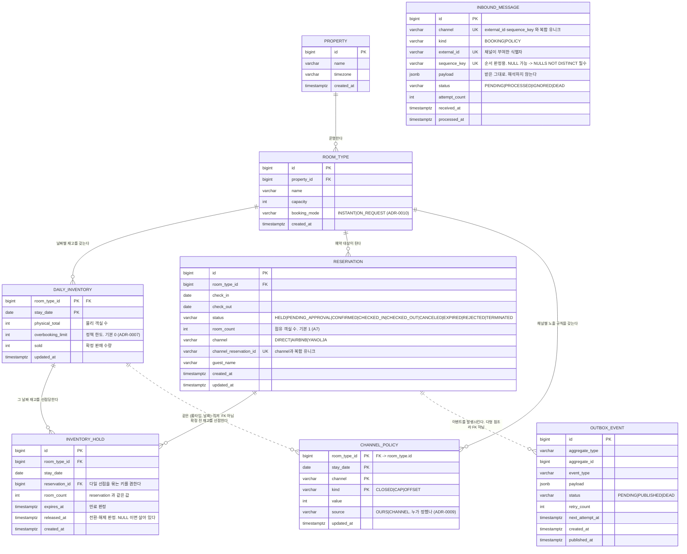
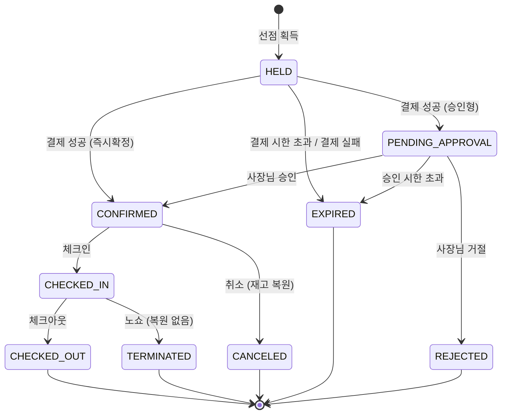

# 도메인 모델

## ERD



### ERD 를 읽는 두 가지 주의

**선 모양이 의미를 갖는다.** 실선(`--`)은 **DB FK 로 강제되는 관계**이고,
점선(`..`)은 **키를 공유하거나 논리적으로만 이어진 관계**다. 점선을 FK 로 읽고
마이그레이션에 제약을 넣으면 없어야 할 제약이 생긴다.

**`INBOUND_MESSAGE` 에는 선이 하나도 없다.** 그리다 만 것이 아니라 **의도한 것**이다.
이유는 셋이고, 세 번째가 결정적이다.

| | 이유 |
|---|---|
| ① | **참조 대상이 다른 테이블이다.** `kind` 가 `BOOKING` 이면 `reservation` 을, `POLICY` 면 `channel_policy` 를 가리킨다 |
| ② | **개수도 다르다.** `BOOKING` 은 예약 0~1건, `POLICY` 는 정책 행 0~N건이다. 컬럼 하나는 집합을 가리킬 수 없다 |
| ③ | **끝까지 대상이 없는 행이 정상이다.** 에코(`IGNORED`) 와 해석 실패(`DEAD`) 는 영구히 비어 있다. 예외가 아니라 정상 경로다 |
| ④ | **원본과 해석 결과를 한 행에 섞지 않는다.** `payload` 는 "받은 그대로" 이고, 무엇을 가리키는지는 해석의 **산출물**이다 |

**`POLICY` 알림의 대상 키를 정확히 적으면 이렇다.**

```text
채널 알림 1건  ->  (room_type_id, stay_date, channel) 격자 위의
                   kind 별 정책 행 0~N 개

  예) "6/15 야놀자 닫고 상한 2" 한 건이
        (…, '2026-06-15', 'YANOLJA', 'CLOSED') 와
        (…, '2026-06-15', 'YANOLJA', 'CAP')     두 행을 만든다
```

`channel_policy` 의 PK 는 `(room_type_id, stay_date, channel, kind)` 4개이고
**알림 하나가 `kind` 여러 개를 실어 올 수 있다.** `kind` 를 빼고 세 개로만 적으면
"한 행인가 여러 행인가"를 알 수 없다. 판정과 흡수는 **`kind` 단위 upsert** 로 한다
(`docs/07-reconciliation.md` · ADR-0009).

> **nullable FK 로 저장 자체는 가능하다.** `reservation_id` 를 NULL 로 넣고 처리 단계에서
> 채우면 되고, FK 는 값이 있을 때만 검사한다. **"FK 를 걸면 저장할 수 없다"는 근거가
> 아니다** — 이 문서의 이전 판이 그렇게 적었고, 그것은 틀렸다.
>
> 안 두는 이유는 위 넷이다. 특히 ①·②가 있는 한 nullable FK 로도 **예약 축의 단일 행만**
> 표현된다. `POLICY` 알림은 그 컬럼이 영구히 NULL 이고, 그러면 "NULL 인 이유"가 두 가지로
> 섞인다 — 아직 안 풀렸는가, 애초에 예약이 아닌가. 상태를 그 컬럼으로 읽을 수 없게 된다.
> 정책 쪽을 표현하려면 연결 테이블이 하나 더 필요한데, **그 테이블이 하는 일은 이미
> `channel_policy` 의 PK 가 한다.**

연결은 처리 단계에서 값으로 찾는다 (`docs/07-reconciliation.md`).

**선이 있는 것과 FK 로 강제되는 것이 다르다.**

| 선 | DB 가 강제하는가 |
|---|---|
| `PROPERTY -> ROOM_TYPE` · `ROOM_TYPE -> DAILY_INVENTORY` · `ROOM_TYPE -> RESERVATION` | 예 — FK |
| `RESERVATION -> INVENTORY_HOLD` · `DAILY_INVENTORY -> INVENTORY_HOLD` | 예 — FK 둘 (`#2`) |
| `RESERVATION -> OUTBOX_EVENT` | **아니오** — `aggregate_id` 는 타입이 섞이는 다형 참조다 |
| `ROOM_TYPE -> CHANNEL_POLICY` | 예 — FK (`room_type_id -> room_type.id`) |
| `DAILY_INVENTORY -> CHANNEL_POLICY` | **아니오** — `(room_type_id, stay_date)` 격자를 공유할 뿐이다 |

`DAILY_INVENTORY -> CHANNEL_POLICY` 에 FK 를 걸면 **재고 행이 아직 없는 미래 날짜에
노출 상한을 미리 설정하는 것이 막힌다.** 캡형 운영에서 실제로 필요한 동작이므로
이 관계는 격자 공유로만 둔다 (ADR-0009 · `#36`).

**엔티티 사이에 선이 있어도 JPA 연관 매핑은 두지 않는다.** 이 그림은 데이터의 모양이고,
코드에서 참조는 ID 값으로만 한다 (ADR-0008 · 절대 규칙 12).

### 왜 8개인가

의도적으로 최소화했다. 초안은 5개였고 설계 결정 둘이 셋을 더했다 —
`inventory_hold`(ADR-0010) · `inbound_message` · `channel_policy`(ADR-0009).
셋 다 **없으면 조용히 깨지는 상태가 생겨서** 넣은 것이다.

| 추가 | 없으면 |
|---|---|
| `inventory_hold` | 확정 전 재고를 잡아둘 곳이 없어 결제 중에 방이 팔린다 |
| `inbound_message` | "알림은 왔는데 처리는 안 된" 상태가 남지 않는다 |
| `channel_policy` | 채널이 바꾼 것이 재고인지 정책인지 구분할 장부가 없다 |

실제 PMS라면 `rate_plan`, `room`(개별 호실), `guest`, `folio`,
`housekeeping_task`가 더 있어야 하지만, 이번 문제(재고 정합성)를 증명하는 데
기여하지 않는 테이블은 전부 제외했다.

`channel_mapping`도 별도 테이블로 두지 않고 어댑터 내부 상수로 처리했다.
실제 운영에서는 테이블화 대상이며, 붙을 위치는 `ChannelAdapter` 구현체 경계다.

---

## 핵심 제약

| 제약 | 위치 | 막는 것 |
|---|---|---|
| `PK(room_type_id, stay_date)` | daily_inventory | 동일 날짜 재고 행의 중복 생성 |
| `CHECK (sold >= 0 AND sold <= physical_total + overbooking_limit)` | daily_inventory | 과다 차감 / 음수 재고 |
| `CHECK (room_count > 0)` | reservation · inventory_hold | 음수 수량이 `INV-4` 를 통과하며 `INV-1` 을 깨는 것 |
| `UNIQUE(channel, channel_reservation_id)` | reservation | **중복 웹훅의 1차 방어선** |
| `UNIQUE NULLS NOT DISTINCT(channel, external_id, sequence_key)` | inbound_message | 같은 알림의 재처리 |
| `PK(room_type_id, stay_date, channel, kind)` | channel_policy | 같은 채널·날짜에 규칙 중복 |
| `INDEX(status, next_attempt_at)` | outbox_event | 릴레이 폴링 성능 |

`UNIQUE(channel, channel_reservation_id)`가 이 스키마에서 가장 중요한 한 줄이다.
애플리케이션 레벨 멱등 처리가 경합으로 뚫려도 DB가 최종 방어한다.
`DIRECT` 채널은 `channel_reservation_id`를 내부 생성 UUID로 채워 NULL 허용을 피한다.

---

## 예약 상태 전이



전이 규칙은 `ReservationStatus` enum에 명시적으로 선언하고, 불법 전이는 예외로 막는다.
"어떤 상태에서 어디로 갈 수 있는가"가 코드에 데이터로 존재해야 테스트할 수 있다.

**재고 복원은 `CONFIRMED -> CANCELED`에서만 일어난다.**
선점 상태(`HELD` · `PENDING_APPROVAL`)에서 오는 종료는 아직 차감된 적이 없으므로 복원 대상이 아니다.
이 비대칭을 놓치면 재고가 부풀어 오른다.

---

## 시스템 불변식

모든 테스트의 후처리에서 검증한다. 개별 케이스가 아니라 **시스템 전체의 참**을 확인한다.

<details>
<summary><b>불변식이 무엇인가 — 이 저장소를 처음 보는 경우</b></summary>

<br>

**불변식(invariant)은 "언제 어느 순간에도 참이어야 하는 등식"이다.**
테스트가 끝날 때마다 이 등식들을 검사해서, 하나라도 거짓이면 실패로 본다.

재고 판정은 (방 종류 × 날짜) 조합마다 **양 두 개**를 본다.

| 양 | 뜻 | 핵심 |
|---|---|---|
| `total` | 그 날짜에 팔 수 있는 방 개수 | 거의 안 바뀐다. **컬럼이 아니라 계산값이다** |
| `sold` | 그중 몇 개가 팔렸는가 | 실제 컬럼. 예약·취소마다 바뀐다 |

> **`total` 이라는 컬럼은 없다.** `physical_total + overbooking_limit` 로 계산한다.
> 둘을 따로 두는 이유는 아래 「`total` 은 컬럼이 아니라 계산값이다」에 있다.
> **불변식 서술에는 `total` 을 쓰고, `CHECK` 제약과 마이그레이션에는 실제 컬럼 두 개를 쓴다.**

`sold` 는 **카운터**다. 예약이 들어오면 1 올리고 취소되면 1 내린다.
그런데 카운터는 틀릴 수 있다 — 동시 요청, 중복 수신, 재시도 어디서든 어긋난다.

그래서 **카운터를 믿지 않고 사실과 대조한다.**

```
sold 라는 숫자        vs        실제로 그 날짜를 쓰는 예약 건수
   (카운터)                          (사실)
```

이 둘이 같은지 보는 것이 `INV-2` 이고, **이 저장소가 하는 주장의 전부가 여기 걸려 있다.**
`sold` 가 실제보다 작으면 이미 팔린 방을 또 팔고(오버부킹), 크면 있는 방을 못 판다(기회손실).

> 왜 `sold` 를 지우고 매번 세지 않는가. 예약 테이블을 매번 집계하면 조회마다 비용이 들고,
> 무엇보다 **동시 예약을 막을 자리가 없어진다.** 카운터가 있는 행을 잠가야 "잔여 1개에 100명이
> 동시에 요청"을 직렬화할 수 있다. 카운터는 성능 최적화가 아니라 **경합의 직렬화 지점**이다.

</details>

```
INV-1  모든 (room_type_id, stay_date)에 대해  0 <= sold <= total

       total = physical_total + overbooking_limit          ← ADR-0007. 컬럼이 아니라 계산값

INV-2  모든 (room_type_id, stay_date)에 대해
       sold == SUM(해당 날짜를 포함하고 재고를 점유 중인 예약의 room_count)

INV-3  모든 CONFIRMED 예약에 대해 check_in < check_out

INV-4  모든 (room_type_id, stay_date)에 대해
       sold + SUM(유효 선점의 room_count) <= total          ← 과선점 금지 (ADR-0010)

       유효 선점 = expires_at > now()          만료되지 않았고
                   AND released_at IS NULL     아직 확정·해제되지도 않았다
```

INV-2가 실질적 핵심이다. 재고 카운터와 예약 사실이 어긋나는 순간을 잡아낸다.

### 재고 점유 상태 집합

`INV-2`의 카운트 대상은 **재고를 점유 중인 상태**다. `CONFIRMED` 하나가 아니다.

```
재고 점유 상태 = { CONFIRMED, CHECKED_IN, CHECKED_OUT, TERMINATED }
```

**`TERMINATED`(노쇼)가 여기 들어가는 것이 직관에 반한다.** 손님이 오지 않았는데 왜
세는가 — 그 날짜 방을 잡아 두었고 당일은 되팔 수도 없었으므로 팔린 것이 맞다.
아래 "기준은 타임라인 위의 구간이 아니다" 에서 다시 다룬다. 이 집합의 단일 진실
원천은 `ReservationStatus.OCCUPYING` 이다.

`CONFIRMED` 하나만 세면 **손님이 체크인만 해도 불변식이 깨진다.** 숫자로 따라가 본다.

#### 손님 한 명을 따라가 본다

디럭스룸 10개, 3월 1일. 예약 한 건이 들어오고 그 손님이 체크인하는 것까지다.

```
① 예약 확정
     sold = 1          예약 상태 = CONFIRMED
     검사:  sold(1)  ==  CONFIRMED 예약 수(1)        참

② 손님이 체크인
     sold = 1          예약 상태 = CHECKED_IN
     검사:  sold(1)  ==  CONFIRMED 예약 수(0)        거짓  ← 깨졌다
```

**두 숫자는 둘 다 정상이다.** 틀린 것은 검사식이다.

| | 값 | 이게 맞는가 |
|---|---|---|
| `sold` 가 1 로 남았다 | 1 | **맞다.** 손님이 그 방을 쓰고 있다. 재고를 되돌리는 것은 취소일 때뿐이다 (절대 규칙 7) |
| `CONFIRMED` 예약 수가 0 이다 | 0 | **맞다.** 상태가 정말로 `CHECKED_IN` 으로 바뀌었다 |
| `sold == CONFIRMED 예약 수` | — | **틀렸다.** 방을 쓰고 있는 손님을 세지 않는 식이다 |

T1~T4 가 체크인 경로를 밟지 않아서 아직 드러나지 않을 뿐, **정의 자체가 틀렸다.**

#### 왜 없는 것보다 나쁜가

빨간불이 뜨는 것 자체는 문제가 아니다. **문제는 그 빨간불을 고치는 방향이다.**

`sold(1) != COUNT(0)` 을 보면 가장 먼저 손이 가는 수정은 **`sold` 를 0 으로 맞추는 것**이다.

```
sold = 0  ->  "3월 1일 디럭스룸은 안 팔렸다"  ->  같은 방이 다시 팔린다
          ->  3월 1일에 손님 두 명이 같은 방으로 체크인한다
```

**정합성을 지키려고 만든 불변식이 오버부킹을 유도한다** — 이 저장소가 0 으로 만들겠다고 선언한 실패다.

```
없는 불변식   아무것도 승인하지 않는다
틀린 불변식   잘못된 상태를 승인한다.  그리고 맞추라고 요구한다
```

### 점유의 판정 기준은 "sold 에 반영된 채로 남아 있는가"다

집합을 열거로 외우지 않는다. 상태마다 두 가지만 물으면 답이 나온다.

```
차감된 적이 있는가?  ─ 아니오 ─▶ 점유 아님
        │
        예
        │
복원되었는가?        ─ 예 ───▶ 점유 아님
        │
        아니오
        │
        ▼
      점유
```

| 상태 | 차감된 적 | 복원됨 | 점유 |
|---|---|---|---|
| `HELD` · `PENDING_APPROVAL` | 아니오 | — | **아님** — 선점 중이며 아직 차감되지 않았다. `INV-4` 가 따로 센다 |
| `EXPIRED` · `REJECTED` | 아니오 | — | **아님** — 차감된 적이 없다 |
| `CONFIRMED` | 예 | 아니오 | 점유 |
| `CHECKED_IN` | 예 | 아니오 | 점유 |
| `CHECKED_OUT` | 예 | 아니오 | 점유 |
| `TERMINATED` | 예 | 아니오 | 점유 — 노쇼. 그 날짜는 소비됐다 |
| `CANCELED` | 예 | **예** | **아님** — 복원됐다 |

**빠지는 이유가 두 갈래다.** `HELD` · `PENDING_APPROVAL` · `EXPIRED` · `REJECTED` 는 **아직 차감되지 않았고**,
`CANCELED` 는 **차감됐다가 되돌려졌다.** 결과는 같지만 경로가 달라서 복원 알고리즘이 둘을 다르게 다룬다 —
차감된 적 없는 상태에서 오는 종료는 복원 대상이 아니다.

이 기준은 상태가 늘어도 흔들리지 않는다. 새 상태가 생기면 두 질문에 답하면 되고,
**정의를 다시 쓰지 않는다.**

#### `CHECKED_OUT` 을 세는 이유

셋 중 이것이 가장 직관에 어긋난다. **손님이 이미 나갔는데 왜 파는 중으로 세는가.**

재고 테이블의 단위가 답이다. `daily_inventory` 는 **(룸타입 × 날짜)** 마다 한 행이고,
`3월 1일` 행은 *"3월 1일의 방이 몇 개 팔렸나"* 를 기록한다.

```
손님이 3월 2일에 퇴실했다   ->  3월 2일 행은 비어 있다
                            ->  3월 1일 행은 여전히 sold = 1
```

**3월 2일이 되어도 3월 1일을 되팔 수는 없다.** 숙박 재고는 소멸성이므로
그 날짜는 이미 소비됐고, 그 사실은 되돌아가지 않는다.

즉 `CHECKED_OUT` 은 "방이 비었다"가 아니라 **"그 날짜를 다 썼다"** 는 뜻이다.
방이 비는 것은 다음 날짜의 사건이고, 그 날짜에는 애초에 그 예약이 걸려 있지 않다
(`[check_in, check_out)` 반개구간).

#### 기준은 타임라인 위의 구간이 아니다

`"확정부터 체크아웃까지"` 로 외우면 다음 상태에서 틀린다.

```
안 센다    CANCELED                                          <- 되돌렸다
센다      CONFIRMED · CHECKED_IN · CHECKED_OUT · TERMINATED   <- 되돌리지 않았다
```

**`CANCELED` 는 `CONFIRMED` 뒤고 `TERMINATED`(노쇼)는 `CHECKED_IN` 뒤다.
둘 다 "뒤"인데 결과가 반대다.** 그래서 "어디까지"로는 답이 나오지 않는다.
기준은 순서가 아니라 **카운터를 되돌렸는가** 하나다.

노쇼가 이 규칙의 가장 강한 시험이다. 손님이 오지도 않았는데 센다 —
그 날짜 방을 잡아 두었으니 팔린 것이 맞고, 당일은 이미 팔 수 없으니 되돌릴 것도 없다.
`#33` 이 `TERMINATED` 를 점유로 넣은 근거가 이것이다.

정의가 여러 곳에 흩어지지 않도록 단일 진실 원천을 enum 에 둔다.

```kotlin
enum class ReservationStatus {
    HELD, PENDING_APPROVAL,                              // 선점 보유. sold 에 없다
    CONFIRMED, CHECKED_IN, CHECKED_OUT, TERMINATED,      // 점유
    EXPIRED, REJECTED, CANCELED;                         // 어느 쪽도 아니다

    val occupiesInventory: Boolean get() = this in OCCUPYING
    val holdsInventory: Boolean get() = this in HOLDING

    companion object {
        val OCCUPYING = setOf(CONFIRMED, CHECKED_IN, CHECKED_OUT, TERMINATED)
        val HOLDING = setOf(HELD, PENDING_APPROVAL)
    }
}
```

불변식 검증기와 도메인 로직이 같은 정의를 본다. 두 곳이 어긋날 자리가 없다.

세 집합으로 갈린다. 다만 **두 집합의 쓰임이 다르다.**

| | 판정에 필요한 것 |
|---|---|
| `OCCUPYING` (`INV-2`) | **상태만으로 결정된다.** 그 상태면 `sold` 에 반영되어 있다 |
| `HOLDING` (`INV-4`) | **상태만으로는 부족하다.** `HELD` 인 행 중 만료되거나 이미 해제된 것은 세지 않는다 |

```
유효 선점 = status IN HOLDING          상태 후보
            AND expires_at > now()      만료되지 않았고
            AND released_at IS NULL     아직 확정·해제되지도 않았다
```

**`holdsInventory` 는 후보를 좁히는 것까지다.** 실제 판정은 행 조건 둘이 함께 한다 —
그 둘을 빼면 만료된 선점까지 세어 잔여가 실제보다 적게 나온다.
`INV-4` 검증기는 상태가 아니라 **이 세 조건을 직접** 확인해야 한다.

```
점유 (sold 에 반영)  = { CONFIRMED, CHECKED_IN, CHECKED_OUT, TERMINATED }
선점 (INV-4 로 계산) = { HELD, PENDING_APPROVAL }
어느 쪽도 아님       = { EXPIRED, REJECTED, CANCELED }
```

`EXPIRED` · `REJECTED` 는 **`sold` 에 한 번도 들어간 적이 없다.** `CANCELED` 는 들어갔다가 복원됐다.
결과는 같지만 경로가 다르므로 복원 알고리즘이 이 셋을 다르게 다룬다.

`OCCUPYING` 에 없는 상태는 전부 점유가 아니다. **제외 목록을 따로 관리하지 않는다** —
관리하면 상태를 추가할 때 두 목록 중 하나를 빼먹는다.

### total 은 컬럼이 아니라 계산값이다

`ADR-0007` 의 결과다. 재고 행은 숫자 셋을 들고 있다.

| 컬럼 | 뜻 | 핵심 |
|---|---|---|
| `physical_total` | 물리 객실 수 | 거의 안 바뀐다 |
| `overbooking_limit` | 정책이 허용한 초과 한도 | **기본값 0** |
| `sold` | 확정 판매 수량 | 예약·취소마다 바뀐다 |

```
total = physical_total + overbooking_limit
```

`INV-1` 은 문자 그대로 유지된다. **시스템은 여전히 "정책이 허용한 선"을 한 칸도 넘지 않고,
그 선이 어디인지만 정책이 정한다.** 넘을 수 있는 것은 의도치 않은 초과뿐이다.

`overbooking_limit = 0` 이면 `total == physical_total` 이므로 현재 동작과 수학적으로 동일하다.
두 값을 따로 두는 이유(지표·경고·되돌림)는 `ADR-0007` 에 있다.

### 예약당 객실 수 — room_count

`INV-2` 가 `COUNT` 가 아니라 `SUM(room_count)` 인 이유다.

실제 예약은 `"디럭스 2개 3박"` 형태로 들어온다. **예약 1건이 객실 1개라는 보장이 없다.**
`reservation.room_count` 를 두고 차감·복원·검증을 이 값 기준으로 한다 (`A7`).

```
차감    sold + room_count <= total
복원    sold -= room_count
검증    sold == SUM(점유 예약의 room_count)
```

**락 구조는 바뀌지 않는다.** 같은 날짜 행을 `stay_date` 오름차순으로 잠그고 더하는 숫자만 다르다.
`ADR-0002` 의 정렬 규칙과 `T2` 가 그대로 유효하다.

#### 왜 "다객실 예약은 범위 밖" 으로 두지 않았나

그쪽이 문단 하나로 끝나 보인다. 그런데 **멱등 제약과 충돌한다.**

`room_count` 가 없으면 `"예약번호 ABC123, 디럭스 2개"` 를 표현할 방법이 **예약 행 2개** 뿐이다.

```
reservation #1   channel=YANOLJA   channel_reservation_id=ABC123
reservation #2   channel=YANOLJA   channel_reservation_id=ABC123   ← UNIQUE 위반
```

`UNIQUE(channel, channel_reservation_id)` 가 INSERT 를 거부한다.
우회하려면 제약에 순번을 넣어야 하는데, 그러면 **중복 수신 방어가 뚫린다** —
같은 알림이 두 번 왔을 때 순번만 다르게 매기면 통과한다.

즉 범위 밖으로 두는 선택은 "다객실 예약을 안 다룬다"가 아니라
**"다객실 예약이 오면 처리할 방법이 없다"** 이고, 다객실 예약은 반드시 온다.

`room_count` 는 그 문제가 없다. 예약 1건, `room_count = 2`, 제약은 그대로다.
**이 컬럼이 오히려 제약을 지킨다.**

#### 부분 성공은 없다

`"디럭스 2개 3박"` 은 `2 × 3 = 6` 칸을 **전부 확보하거나 전부 실패**한다.
5칸이 남아도 예약은 성립하지 않는다.

새로운 구조가 아니다 — 3박 예약이 세 날짜를 전부 확보해야 성립하는 것과 같은 논리이며,
`1개 × d일` 격자가 `n개 × d일` 격자로 늘어난 것뿐이다.

한 칸만 주는 선택(예약을 쪼개기)은 예약 1건이 2건이 되므로 위의 멱등 문제로 되돌아간다.

`DEFAULT 1` 이 기존 개념을 특수 케이스로 흡수한다. **다객실이 예외가 아니라 일반형이 된다.**

---

## 선점(hold) — 확정 전에 재고를 잡아 둔다

판단 근거는 `ADR-0010` 에 있고 여기서는 형태만 적는다.

```sql
CREATE TABLE inventory_hold (
    id             BIGSERIAL   PRIMARY KEY,
    room_type_id   BIGINT      NOT NULL,
    stay_date      DATE        NOT NULL,   -- daily_inventory 와 같은 결
    reservation_id BIGINT      NOT NULL,   -- 다일 선점을 묶는 키를 겸한다
    room_count     INT         NOT NULL CHECK (room_count > 0),  -- A7
    expires_at     TIMESTAMPTZ NOT NULL,   -- 만료 판정
    released_at    TIMESTAMPTZ,            -- 전환·해제 판정. NULL 이면 살아 있다

    FOREIGN KEY (room_type_id, stay_date) REFERENCES daily_inventory (room_type_id, stay_date),
    FOREIGN KEY (reservation_id) REFERENCES reservation (id)
);

CREATE INDEX ix_hold_live ON inventory_hold (room_type_id, stay_date)
    WHERE released_at IS NULL;
```

FK 를 둔다. ERD 가 관계를 표시하므로 DDL 도 그것을 강제해야 한다 —
표시만 하고 강제하지 않으면 **다이어그램이 검증되지 않는 주석**이 된다.

`CHECK (room_count > 0)` 이 `INV-4` 의 증명 전제다. 아래 불변식 절을 볼 것.

### 선점 획득 알고리즘

```
0. 락 순서: reservation -> daily_inventory              ← ADR-0011
   inventory_hold 는 3번 락 아래에서만 만진다            ← 절대 규칙 11
1. 대상 날짜 목록 생성: [check_in, check_out)
2. 날짜를 오름차순 정렬                                ← 데드락 방지 (ADR-0002)
3. 각 날짜 행을 SELECT ... FOR UPDATE 로 잠금          ← 직렬화 지점
4. 전 날짜에 대해 sold + SUM(유효 선점) + room_count <= total 검증
5. 하나라도 실패하면 전체 롤백
6. 전부 통과하면 reservation INSERT (status = HELD)
7. 동일 트랜잭션에서 inventory_hold INSERT (날짜당 1행)
```

**3번에서 잠근 행을 4~7번에서 바꾸지 않는다.** 그 행은 순수하게 뮤텍스로 쓰인다.
그런데 선점을 잡으려는 모든 트랜잭션이 반드시 그 락을 먼저 지나가므로,
집계와 INSERT 사이에 다른 트랜잭션이 끼어들 수 없다.

**테이블이 하나 늘었는데 락 순서는 늘지 않는다.** 그래서 절대 규칙 11 이 필요하다 —
값을 바꾸지 않는 락은 없어도 되는 것처럼 보이고, 지우면 과선점이 열린다.

6번이 7번보다 앞인 이유는 `inventory_hold.reservation_id` 가 NOT NULL 이기 때문이다.
INSERT 는 기존 행과 경합하지 않으므로 이 순서가 락 구조를 바꾸지 않는다.

### 선점 해제와 확정

```
확정   [트랜잭션]  락 순서는 reservation -> daily_inventory (ADR-0011)
                  reservation 조건부 UPDATE
                    즉시확정 경로 : WHERE status = 'HELD'
                    승인형 경로   : WHERE status = 'PENDING_APPROVAL'
                  daily_inventory 잠금, sold += room_count
                  inventory_hold.released_at = now()
                  outbox_event INSERT

대기   [트랜잭션]  reservation 조건부 UPDATE (WHERE status = 'HELD')
                  status = PENDING_APPROVAL, inventory_hold.expires_at 을 승인 시한으로 연장
                  선점은 유지된다. sold 는 건드리지 않는다

만료   판정만 시간 조건으로 한다. sold 는 건드리지 않는다
       released_at 마킹은 얇은 스케줄러가 한다 (ADR-0010 결정 6)
```

**확정 경로가 둘이다.** 즉시확정 채널은 `HELD` 에서, 승인형 채널은 `PENDING_APPROVAL` 에서 온다.
조건부 UPDATE 의 시작 상태만 다르고 나머지는 같으므로 **같은 트랜잭션 형태를 공유한다.**
한쪽만 구현하면 다른 쪽 예약이 확정되지 않거나 계약 없는 별도 경로가 생긴다.

**만료는 재고를 되돌리는 사건이 아니다.** `sold` 에 들어간 적이 없으므로 되돌릴 것이 없다.

다만 **만료 시 발행할 이벤트는 상태에 따라 다르다.**

| 만료된 상태 | 승인 취소 이벤트 | 왜 |
|---|---|---|
| `HELD` | **발행하지 않는다** | 결제 전이므로 취소할 승인이 없다 |
| `PENDING_APPROVAL` | **발행한다** | 카드 승인이 걸려 있다 |

`released_at` 갱신과 승인 취소 `outbox_event` INSERT 는 **같은 트랜잭션**이다(절대 규칙 3).
분리하면 "선점은 풀렸는데 승인은 남은" 상태가 생긴다.
그래서 그 스케줄러는 장애가 나도 정합성을 깨지 않는다.

---

## 재고 차감 알고리즘

```
0. 락 순서: reservation -> daily_inventory              ← ADR-0011. 한 트랜잭션 안이다
1. 예약 대상 날짜 목록 생성: [check_in, check_out)   ← 체크아웃 당일은 미포함
2. 날짜를 오름차순 정렬                                ← 데드락 방지 (ADR-0002)
3. 각 날짜 행을 SELECT ... FOR UPDATE 로 잠금
4. 전 날짜에 대해 sold + room_count <= total 검증     ← total = physical_total + overbooking_limit
5. 하나라도 실패하면 전체 롤백
6. 전부 통과하면 sold += room_count
7. 동일 트랜잭션에서 reservation INSERT + outbox_event INSERT
```

**2번이 이 알고리즘에서 가장 저평가받기 쉬운 줄이다.**
다일 예약은 여러 행을 잠근다. 락 획득 순서가 요청마다 다르면 데드락이 발생한다.
`stay_date` 오름차순 고정으로 전역 순서를 강제한다.

**7번이 Outbox 패턴의 전부다.**
예약 저장과 이벤트 기록이 같은 트랜잭션이므로 dual-write가 원천적으로 사라진다.
외부 채널 호출은 커밋 이후 릴레이가 담당한다.

---

## 재고 복원 알고리즘

차감의 거울상이다. **다만 대칭이 아닌 지점이 하나 있고, 그것이 이 알고리즘의 전부다.**

```
0. 락 순서: reservation -> daily_inventory              ← ADR-0011. 한 트랜잭션 안이다
1. reservation 조건부 UPDATE
      UPDATE reservation SET status = 'CANCELED', updated_at = now()
       WHERE id = ? AND status = 'CONFIRMED'
2. rowcount 0 이면 여기서 끝. 재고를 잠그지 않고 커밋한다   ← 멱등. 2xx 를 반환한다
3. 대상 날짜 목록 생성: [check_in, check_out)
4. 날짜를 오름차순 정렬                                ← 데드락 방지 (ADR-0002)
5. 각 날짜 행을 SELECT ... FOR UPDATE 로 잠금
6. sold -= room_count                                  ← A7. 1 이 아니다
7. 동일 트랜잭션에서 outbox_event INSERT               ← 절대 규칙 3
```

### 1번이 세 가지를 동시에 준다

예약 행에 **별도 락을 잡지 않는다.** `UPDATE` 자체가 행 락을 잡고 `WHERE` 절이 중복을 걸러낸다.
`SELECT FOR UPDATE` → 검증 → `UPDATE` 세 단계가 한 문장으로 접힌다.

| 얻는 것 | 이유 |
|---|---|
| **동시 취소 방어** | 두 번째 트랜잭션은 `rowcount` 0 → 복원을 실행하지 않는다 |
| **취소 웹훅 멱등** | 이미 취소된 건에 2xx → 채널 재시도를 유발하지 않는다 (절대 규칙 5) |
| **락 순서 강제** | `reservation` → `daily_inventory` 가 **코드 구조로 강제된다** (ADR-0011) |

세 번째가 특히 값을 한다. **`rowcount` 를 봐야 다음 단계로 갈지 알 수 있으므로,
순서를 어기려면 코드를 뒤집어야 한다.** 규칙을 지키는 것이 아니라 어길 수 없는 형태다.

### 왜 동시 취소가 일상적인 입력인가

취소 웹훅도 **at-least-once** 다(`A4`). 같은 취소가 두 번 오는 것은 예외가 아니라 계약의 일부다.
방어가 없으면 이렇게 된다.

```
① SELECT reservation  -> CONFIRMED
② SELECT reservation  -> CONFIRMED      <- 둘 다 통과한다
① 재고 락, sold -= 1, CANCELED, commit
② 재고 락, sold -= 1, CANCELED, commit
```

**예약은 1건인데 `sold` 가 2 줄었다.** 재고가 부풀고 그 자리에 새 예약이 들어오면 **오버부킹**이다.
`T3`(#5)는 예약 웹훅 중복만 다루고 취소 웹훅 중복은 다루지 않는다.

### `WHERE status = 'CONFIRMED'` 가 제외 목록 전체를 대신한다

절대 규칙 7 의 비대칭이 **조건문이 아니라 쿼리 조건으로 표현된다.**

| 취소·종료가 오는 상태 | 복원 | 왜 |
|---|---|---|
| `CONFIRMED` | **한다** | 차감했고 아직 되돌리지 않았다 |
| `HELD` · `PENDING_APPROVAL` | 아니다 | **차감된 적이 없다.** 선점은 `INV-4` 가 따로 센다 |
| `EXPIRED` · `REJECTED` | 아니다 | 차감된 적이 없다 |
| `TERMINATED` | 아니다 | 그 날짜는 이미 소비됐다 |
| `CANCELED` | 아니다 | 이미 되돌렸다 |

**제외 목록을 관리하지 않는다.** 조건 한 줄이 다섯 경우를 모두 걸러내고,
**상태가 늘어도 이 코드를 고치지 않는다** — 새 상태는 자동으로 복원 대상에서 빠진다.

`ADR-0010` 이 상태를 5개에서 9개로 늘렸는데 이 조건이 그대로 유효한 것이 그 증거다.
`CHECKED_IN -> CANCELED` 를 만들지 않고 `TERMINATED` 로 보낸 것도 이 조건을 지키기 위함이다.

### 노쇼 처리 — 같은 패턴, 재고 경로 없음

```
UPDATE reservation SET status = 'TERMINATED', updated_at = now()
 WHERE id = ? AND status = 'CHECKED_IN'
```

**재고를 건드리지 않는다.** `TERMINATED` 가 점유 집합에 있으므로 `sold` 는 그대로다.
같은 조건부 UPDATE 패턴이지만 **재고 경로가 없는 전이**이며, 그래서 `T5` · `T6` 의 대상이 아니다.

취소·종료 경로를 한곳에 모아 두면 패턴이 일관되게 적용된다.

### 선점 해제와의 차이

선점(`HELD` · `PENDING_APPROVAL`)에서 오는 종료는 **복원이 아니다.**
`sold` 에 들어간 적이 없으므로 되돌릴 것이 없고, `inventory_hold.released_at` 마킹만 한다.
만료는 시간 조건으로 판정되므로 마킹조차 정합성 경로가 아니다 (`ADR-0010` 결정 2·6).

---

## 구현 노트: 엔티티는 `data class`가 아니다

Kotlin으로 JPA 엔티티를 만들 때 가장 흔한 실수이므로 명시한다.

```kotlin
// ❌ 하지 않는다
@Entity
data class Reservation(...)

// ✅ 한다
@Entity
class Reservation(
    @Id @GeneratedValue val id: Long? = null,
    ...
) {
    override fun equals(other: Any?): Boolean =
        this === other || (other is Reservation && id != null && id == other.id)

    override fun hashCode(): Int = javaClass.hashCode()
}
```

`data class`의 자동 생성 `equals`/`hashCode`는 모든 프로퍼티를 사용한다.
지연 로딩 프록시에서 호출되면 의도치 않은 초기화가 발생하고,
`id`가 null인 비영속 상태와 영속 상태의 해시가 달라져
컬렉션에 담은 뒤 저장하면 다시 찾지 못한다.

`hashCode`를 `javaClass.hashCode()`로 고정하는 것은
영속 전후로 해시가 변하지 않게 하기 위함이다.
해시 버킷 분산은 포기하지만, 엔티티를 대량으로 해시 컬렉션에 넣지 않으므로 문제되지 않는다.

`data class`는 엔티티 경계 **바깥**에서만 쓴다 — DTO, Outbox 이벤트 페이로드, 값 객체.

### 컴파일러 플러그인

```kotlin
plugins {
    kotlin("plugin.spring")  // allOpen
    kotlin("plugin.jpa")     // noArg
}
```

Kotlin 클래스는 기본 `final`이다.
Spring의 CGLIB 프록시와 Hibernate의 지연 로딩 프록시가 모두 상속을 요구하므로
이 플러그인 없이는 런타임에 실패한다.
