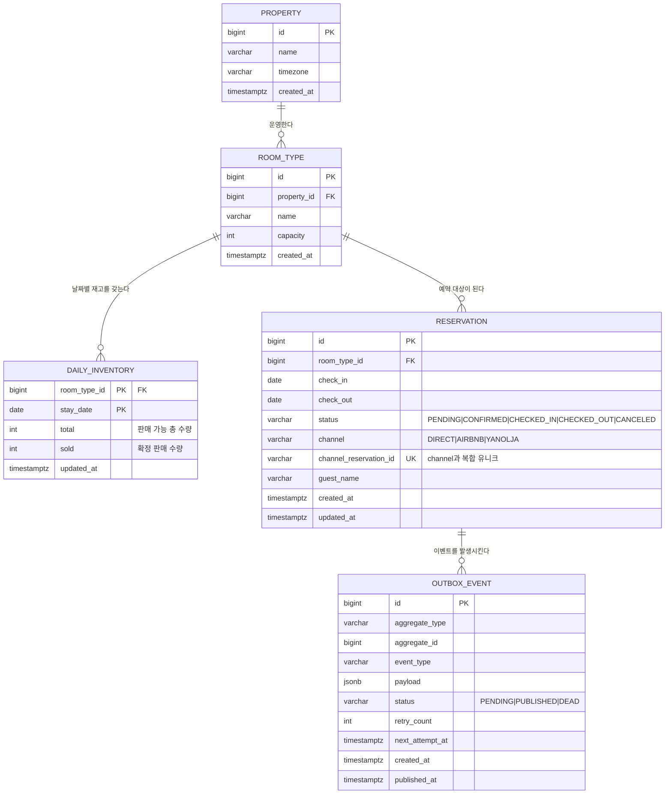
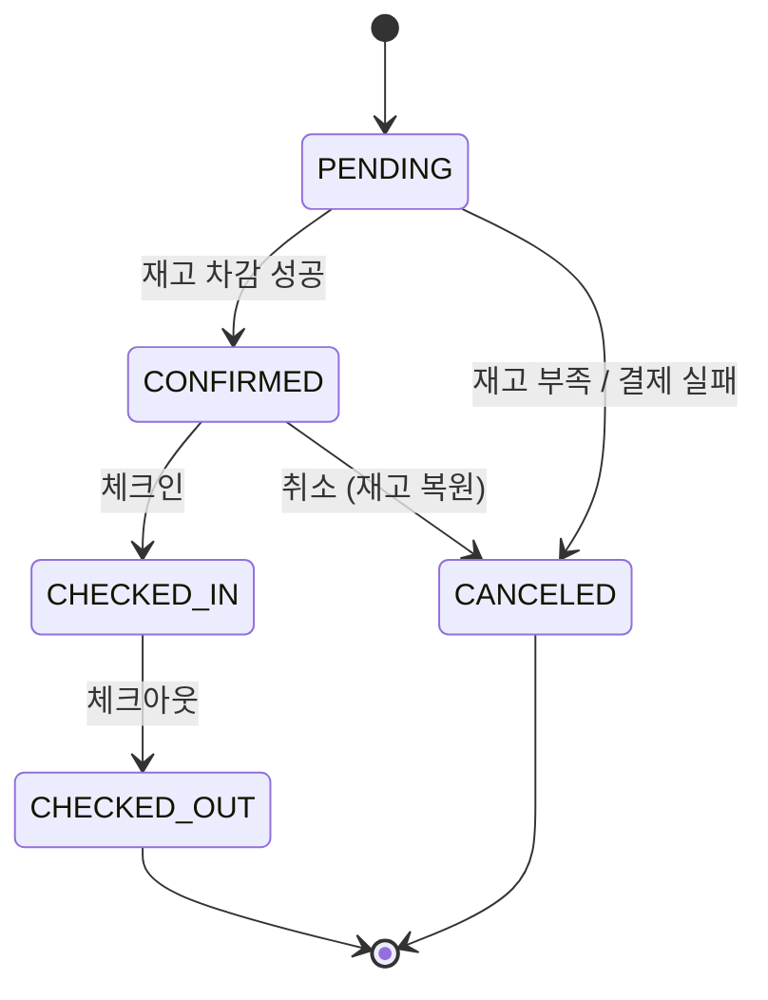

# 도메인 모델

## ERD



### 왜 5개인가

의도적으로 최소화했다. 실제 PMS라면 `rate_plan`, `room`(개별 호실), `guest`, `folio`,
`housekeeping_task`가 더 있어야 하지만, 이번 문제(재고 정합성)를 증명하는 데
기여하지 않는 테이블은 전부 제외했다.

`channel_mapping`도 별도 테이블로 두지 않고 어댑터 내부 상수로 처리했다.
실제 운영에서는 테이블화 대상이며, 붙을 위치는 `ChannelAdapter` 구현체 경계다.

---

## 핵심 제약

| 제약 | 위치 | 막는 것 |
|---|---|---|
| `PK(room_type_id, stay_date)` | daily_inventory | 동일 날짜 재고 행의 중복 생성 |
| `CHECK (sold >= 0 AND sold <= total)` | daily_inventory | 과다 차감 / 음수 재고 |
| `UNIQUE(channel, channel_reservation_id)` | reservation | **중복 웹훅의 1차 방어선** |
| `INDEX(status, next_attempt_at)` | outbox_event | 릴레이 폴링 성능 |

`UNIQUE(channel, channel_reservation_id)`가 이 스키마에서 가장 중요한 한 줄이다.
애플리케이션 레벨 멱등 처리가 경합으로 뚫려도 DB가 최종 방어한다.
`DIRECT` 채널은 `channel_reservation_id`를 내부 생성 UUID로 채워 NULL 허용을 피한다.

---

## 예약 상태 전이



전이 규칙은 `ReservationStatus` enum에 명시적으로 선언하고, 불법 전이는 예외로 막는다.
"어떤 상태에서 어디로 갈 수 있는가"가 코드에 데이터로 존재해야 테스트할 수 있다.

**재고 복원은 `CONFIRMED -> CANCELED`에서만 일어난다.**
`PENDING -> CANCELED`는 아직 차감된 적이 없으므로 복원 대상이 아니다.
이 비대칭을 놓치면 재고가 부풀어 오른다.

---

## 시스템 불변식

모든 테스트의 후처리에서 검증한다. 개별 케이스가 아니라 **시스템 전체의 참**을 확인한다.

<details>
<summary><b>불변식이 무엇인가 — 이 저장소를 처음 보는 경우</b></summary>

<br>

**불변식(invariant)은 "언제 어느 순간에도 참이어야 하는 등식"이다.**
테스트가 끝날 때마다 이 등식들을 검사해서, 하나라도 거짓이면 실패로 본다.

재고 테이블 `daily_inventory` 는 (방 종류 × 날짜) 조합마다 숫자 두 개를 들고 있다.

| 컬럼 | 뜻 | 핵심 |
|---|---|---|
| `total` | 그 날짜에 팔 수 있는 방 개수 | 거의 안 바뀐다 |
| `sold` | 그중 몇 개가 팔렸는가 | 예약·취소마다 바뀐다 |

`sold` 는 **카운터**다. 예약이 들어오면 1 올리고 취소되면 1 내린다.
그런데 카운터는 틀릴 수 있다 — 동시 요청, 중복 수신, 재시도 어디서든 어긋난다.

그래서 **카운터를 믿지 않고 사실과 대조한다.**

```
sold 라는 숫자        vs        실제로 그 날짜를 쓰는 예약 건수
   (카운터)                          (사실)
```

이 둘이 같은지 보는 것이 `INV-2` 이고, **이 저장소가 하는 주장의 전부가 여기 걸려 있다.**
`sold` 가 실제보다 작으면 이미 팔린 방을 또 팔고(오버부킹), 크면 있는 방을 못 판다(기회손실).

> 왜 `sold` 를 지우고 매번 세지 않는가. 예약 테이블을 매번 집계하면 조회마다 비용이 들고,
> 무엇보다 **동시 예약을 막을 자리가 없어진다.** 카운터가 있는 행을 잠가야 "잔여 1개에 100명이
> 동시에 요청"을 직렬화할 수 있다. 카운터는 성능 최적화가 아니라 **경합의 직렬화 지점**이다.

</details>

```
INV-1  모든 (room_type_id, stay_date)에 대해  0 <= sold <= total

INV-2  모든 (room_type_id, stay_date)에 대해
       sold == COUNT(해당 날짜를 포함하고 재고를 점유 중인 예약)

INV-3  모든 CONFIRMED 예약에 대해 check_in < check_out
```

INV-2가 실질적 핵심이다. 재고 카운터와 예약 사실이 어긋나는 순간을 잡아낸다.

### 재고 점유 상태 집합

`INV-2`의 카운트 대상은 **재고를 점유 중인 상태**다. `CONFIRMED` 하나가 아니다.

```
재고 점유 상태 = { CONFIRMED, CHECKED_IN, CHECKED_OUT }
```

`CONFIRMED` 하나만 세면 **손님이 체크인만 해도 불변식이 깨진다.** 숫자로 따라가 본다.

#### 손님 한 명을 따라가 본다

디럭스룸 10개, 3월 1일. 예약 한 건이 들어오고 그 손님이 체크인하는 것까지다.

```
① 예약 확정
     sold = 1          예약 상태 = CONFIRMED
     검사:  sold(1)  ==  CONFIRMED 예약 수(1)        참

② 손님이 체크인
     sold = 1          예약 상태 = CHECKED_IN
     검사:  sold(1)  ==  CONFIRMED 예약 수(0)        거짓  ← 깨졌다
```

**두 숫자는 둘 다 정상이다.** 틀린 것은 검사식이다.

| | 값 | 이게 맞는가 |
|---|---|---|
| `sold` 가 1 로 남았다 | 1 | **맞다.** 손님이 그 방을 쓰고 있다. 재고를 되돌리는 것은 취소일 때뿐이다 (절대 규칙 7) |
| `CONFIRMED` 예약 수가 0 이다 | 0 | **맞다.** 상태가 정말로 `CHECKED_IN` 으로 바뀌었다 |
| `sold == CONFIRMED 예약 수` | — | **틀렸다.** 방을 쓰고 있는 손님을 세지 않는 식이다 |

T1~T4 가 체크인 경로를 밟지 않아서 아직 드러나지 않을 뿐, **정의 자체가 틀렸다.**

#### 왜 없는 것보다 나쁜가

빨간불이 뜨는 것 자체는 문제가 아니다. **문제는 그 빨간불을 고치는 방향이다.**

`sold(1) != COUNT(0)` 을 보면 가장 먼저 손이 가는 수정은 **`sold` 를 0 으로 맞추는 것**이다.

```
sold = 0  ->  "3월 1일 디럭스룸은 안 팔렸다"  ->  같은 방이 다시 팔린다
          ->  3월 1일에 손님 두 명이 같은 방으로 체크인한다
```

**정합성을 지키려고 만든 불변식이 오버부킹을 유도한다** — 이 저장소가 0 으로 만들겠다고 선언한 실패다.

```
없는 불변식   아무것도 승인하지 않는다
틀린 불변식   잘못된 상태를 승인한다.  그리고 맞추라고 요구한다
```

### 점유의 판정 기준은 "sold 에 반영된 채로 남아 있는가"다

집합을 열거로 외우지 않는다. 상태마다 두 가지만 물으면 답이 나온다.

```
차감된 적이 있는가?  ─ 아니오 ─▶ 점유 아님
        │
        예
        │
복원되었는가?        ─ 예 ───▶ 점유 아님
        │
        아니오
        │
        ▼
      점유
```

| 상태 | 차감된 적 | 복원됨 | 점유 |
|---|---|---|---|
| `PENDING` | 아니오 | — | **아님** — 차감 전이다 |
| `CONFIRMED` | 예 | 아니오 | 점유 |
| `CHECKED_IN` | 예 | 아니오 | 점유 |
| `CHECKED_OUT` | 예 | 아니오 | 점유 |
| `CANCELED` | 예 | **예** | **아님** — 복원됐다 |

**빠지는 것이 둘이고, 빠지는 이유가 서로 다르다.** `PENDING` 은 아직 차감되지 않았고
`CANCELED` 는 차감됐다가 되돌려졌다. 결과는 같지만 경로가 달라서
복원 알고리즘이 이 둘을 다르게 다룬다 — `PENDING -> CANCELED` 는 복원 대상이 아니다.

이 기준은 상태가 늘어도 흔들리지 않는다. 새 상태가 생기면 두 질문에 답하면 되고,
**정의를 다시 쓰지 않는다.**

정의가 여러 곳에 흩어지지 않도록 단일 진실 원천을 enum 에 둔다.

```kotlin
enum class ReservationStatus {
    PENDING, CONFIRMED, CHECKED_IN, CHECKED_OUT, CANCELED;

    val occupiesInventory: Boolean get() = this in OCCUPYING

    companion object {
        val OCCUPYING = setOf(CONFIRMED, CHECKED_IN, CHECKED_OUT)
    }
}
```

불변식 검증기와 도메인 로직이 같은 정의를 본다. 두 곳이 어긋날 자리가 없다.

`OCCUPYING` 에 없는 상태는 전부 점유가 아니다. **제외 목록을 따로 관리하지 않는다** —
관리하면 상태를 추가할 때 두 목록 중 하나를 빼먹는다.

---

## 재고 차감 알고리즘

```
1. 예약 대상 날짜 목록 생성: [check_in, check_out)   ← 체크아웃 당일은 미포함
2. 날짜를 오름차순 정렬                                ← 데드락 방지 (ADR-0002)
3. 각 날짜 행을 SELECT ... FOR UPDATE 로 잠금
4. 전 날짜에 대해 sold + 1 <= total 검증
5. 하나라도 실패하면 전체 롤백
6. 전부 통과하면 sold += 1
7. 동일 트랜잭션에서 reservation INSERT + outbox_event INSERT
```

**2번이 이 알고리즘에서 가장 저평가받기 쉬운 줄이다.**
다일 예약은 여러 행을 잠근다. 락 획득 순서가 요청마다 다르면 데드락이 발생한다.
`stay_date` 오름차순 고정으로 전역 순서를 강제한다.

**7번이 Outbox 패턴의 전부다.**
예약 저장과 이벤트 기록이 같은 트랜잭션이므로 dual-write가 원천적으로 사라진다.
외부 채널 호출은 커밋 이후 릴레이가 담당한다.

---

## 구현 노트: 엔티티는 `data class`가 아니다

Kotlin으로 JPA 엔티티를 만들 때 가장 흔한 실수이므로 명시한다.

```kotlin
// ❌ 하지 않는다
@Entity
data class Reservation(...)

// ✅ 한다
@Entity
class Reservation(
    @Id @GeneratedValue val id: Long? = null,
    ...
) {
    override fun equals(other: Any?): Boolean =
        this === other || (other is Reservation && id != null && id == other.id)

    override fun hashCode(): Int = javaClass.hashCode()
}
```

`data class`의 자동 생성 `equals`/`hashCode`는 모든 프로퍼티를 사용한다.
지연 로딩 프록시에서 호출되면 의도치 않은 초기화가 발생하고,
`id`가 null인 비영속 상태와 영속 상태의 해시가 달라져
컬렉션에 담은 뒤 저장하면 다시 찾지 못한다.

`hashCode`를 `javaClass.hashCode()`로 고정하는 것은
영속 전후로 해시가 변하지 않게 하기 위함이다.
해시 버킷 분산은 포기하지만, 엔티티를 대량으로 해시 컬렉션에 넣지 않으므로 문제되지 않는다.

`data class`는 엔티티 경계 **바깥**에서만 쓴다 — DTO, Outbox 이벤트 페이로드, 값 객체.

### 컴파일러 플러그인

```kotlin
plugins {
    kotlin("plugin.spring")  // allOpen
    kotlin("plugin.jpa")     // noArg
}
```

Kotlin 클래스는 기본 `final`이다.
Spring의 CGLIB 프록시와 Hibernate의 지연 로딩 프록시가 모두 상속을 요구하므로
이 플러그인 없이는 런타임에 실패한다.
